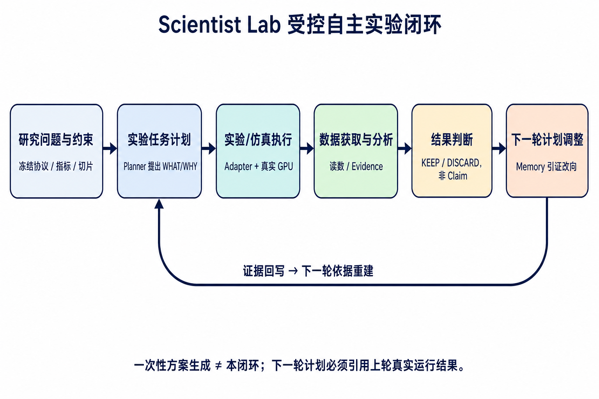
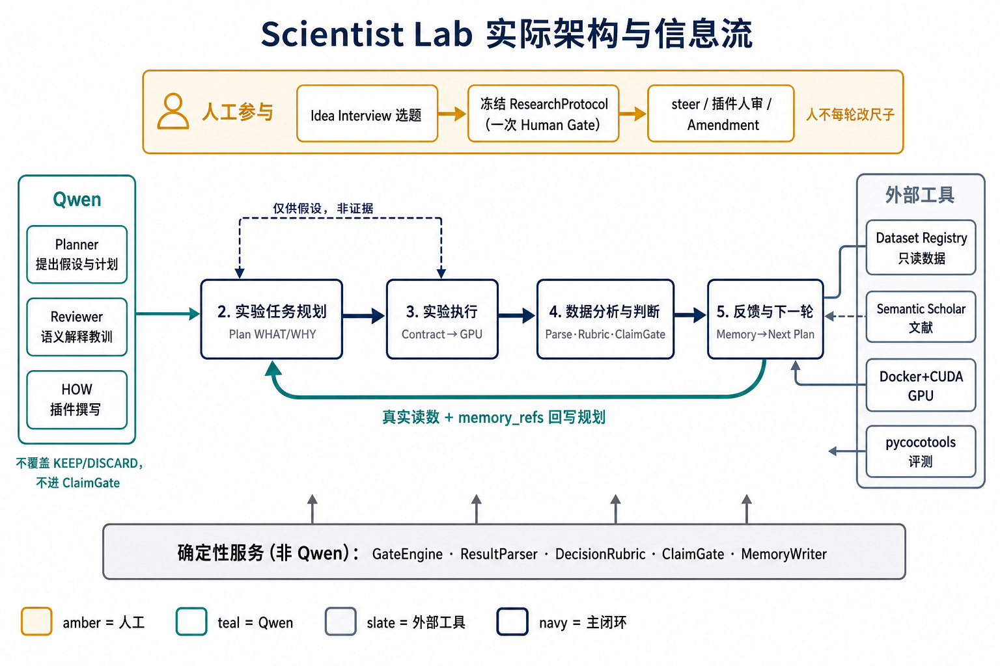
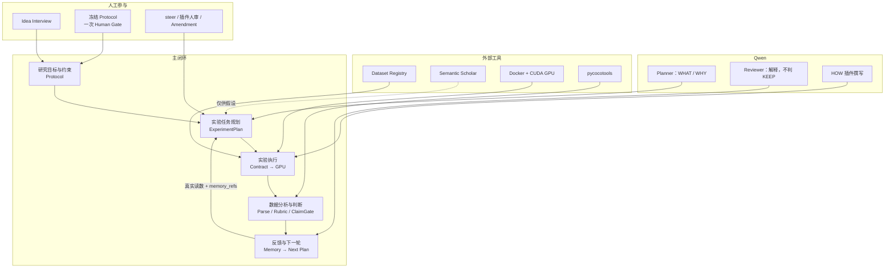
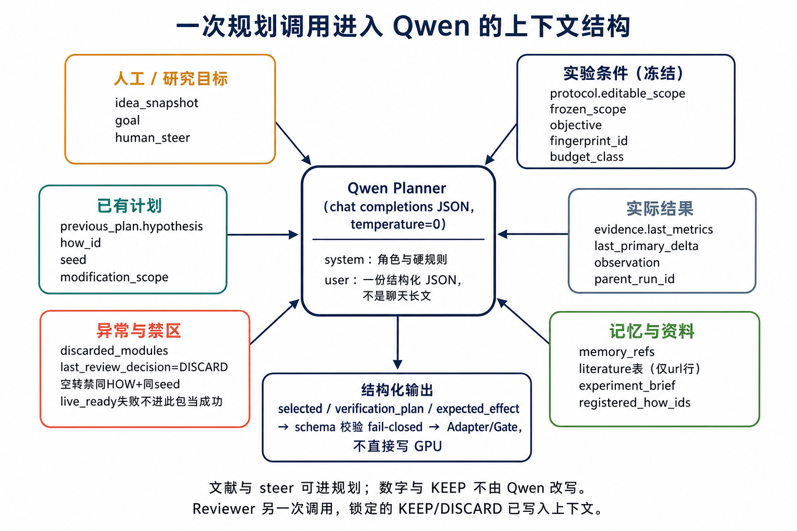
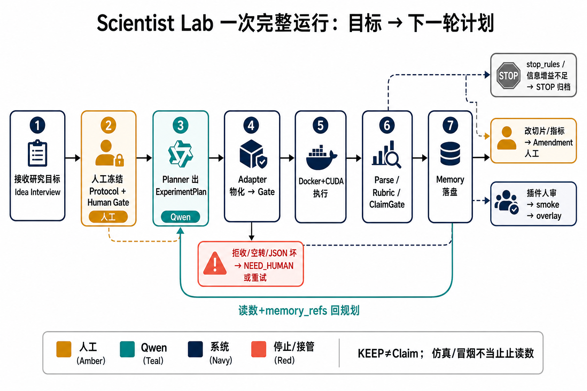

# P2–P4 作品材料　｜　架构与闭环　｜　P13–P19 代表性案例与总体结果

> 本稿供报告撰写使用：P2–P12 为总体；P13–P16 把 V26.5 第 1→2 轮讲透；P17 写第二轮实际变化；P18 只填真实对照/消融；P19 写总体、失败与边界。  
> 第一轮计划只写执行前 `plan.json` 里已有的预期与停机条件，不用事后读数反写。  
> 保留未达声称、Reviewer 故障等异常。第二轮只写实际做了的 F0 消融，不把第 3 轮换种子补进「第一轮触发的调整」。  
> 「无提升」也是有效结果。KEEP ≠ Claim。代表性两轮不能代替总体表现。

---

## 一、团队实际解决的问题

现有实验规划或实验迭代方式，常见不足并不在「会不会列出实验步骤」，而在**方案生成与真实科研迭代之间缺了一段可核验的闭环**。具体表现为下面几项。

**第一，一次性生成完整实验方案，执行结果回不来。** 这里的「回不来」指的是**没有结构化回写**：计划不负责跑实验，也不负责让下一轮引用上一轮的 run / lesson 编号。大模型可以根据题目一次性写出假设、对照表、超参网格和评测指标，看起来像一份完整计划；下一轮若要继续，往往只能重新提示一次，或把上一轮日志摘要塞进上下文。这样得到的是「又一份方案」，不是「由证据驱动的下一枪」。方案文本可以很长、很完整，却无法回答：上一轮究竟跑成了什么、哪一条假设被证伪、下一轮为什么必须改这一处而不是另一处。GPU 跑完、分数写进聊天，若下一轮仍不必引用这些编号，在本作品的口径里仍算「回不来」。

**第二，即便有迭代，也多半是人工读日志后口头改计划，轮次之间没有结构化合约。** 人看完 loss 曲线和 mAP 后，口头决定「下一轮换融合、换种子、换切片」。这些决定写在聊天、会议纪要或个人笔记里，系统并不强制下一轮计划引用上一轮的证据编号。结果是：负结果容易被忘掉或被重新包装成涨点；同一方法同一随机种子会被当成新实验再跑一遍；多变量同时改（融合方式、学习率、评测切片一起动）也无法被识别为无效对照。迭代在形式上发生了，科学上却无法审计「第 N+1 轮为何出现」。

**第三，约束不冻结，轮次之间不可比。** 若模型或操作者可以在迭代中悄悄更换数据集切片、主指标或评测器，则「看起来在进步」可能只是换了更容易的尺子。现有一次性方案生成几乎不处理这件事：方案里可以写「用 mAP 评估」，下一份方案改成「用小目标 AP」，两份方案各自自洽，却不能作为同一条研究链上的前后对照。没有冻结协议时，实验规划软件生成得再完整，也只是互不相干的单次设计。

**第四，读数、去留判断与科学声称混在同一层。** 一次 GPU 跑出更高的分数，常被直接写成「方法有效」「可以发表」。现有自动科研或自动实验助手，往往把「值得继续试」和「已经证明优越」当成同一句话。于是短训、probe、单种子、换切片后的数字，都可能混进最终结论。没有把「这一枪值得保留 / 丢弃 / 复现」与「当前证据允许声称到哪一级」拆开，迭代就越跑越不可信。

本作品针对上述四项中的**全部四项**，核心只做一件事：把实验从「一次性生成方案」改成「在冻结约束下，由真实执行结果驱动的多轮计划调整」。下列能力已经补上，并在真实 GPU 战役上验收过；**不是**仍待完成的愿望。

| 现有做法的病 | 本作品实际怎样让这条不再成立 | 评委可对哪一包 |
|--------------|------------------------------|----------------|
| 一次性方案，结果没有结构化回写 | Round≥1 的 `ExperimentPlan` 必须带 `parent_run_id` / `evidence_runs` / `memory_refs`；Planner 读的是已校验的 `last_metrics`，不是聊天摘要 | V26.5 第 2 轮 `plan_round2_from_run_plan_round1_…` 引用 R1 |
| 口头改计划 | 第 N+1 轮必须能解析到已落盘的 lesson / strategy id；同 HOW+同 seed 当新实验会被门禁拦住 | 同包 `memory_refs`；P0 空转记科学 INCONCLUSIVE，不删账本 |
| 换尺子冒充进步 | `ResearchProtocol.frozen_scope` + 指纹；人闸也不能本轮改切片 / 评测器；修宪必须 `protocol_version+1` | R1 / R2 主键均为 `APS_lowlight`，切片未改 |
| KEEP 写成已证明 | `DecisionRubric` 只管 KEEP / DISCARD / REPLICATE / INCONCLUSIVE；`ClaimGate` 本战役关掉科学声称 | R1 Δ=+0.01676 仍为 ClaimGate BLOCKED |

按闭环顺序，实际补上的仍是这四条：

1. 研究问题、数据切片、主指标和停机规则先冻结，之后每一轮计划都不得静默改尺子；
2. 计划必须能被物化为可执行合同，并在真实 GPU（或同等执行路径）上跑完，而不是停在文本方案；
3. 跑完后必须读数、校验证据、给出去留判断；负结果、空转、混杂对照要能被系统拦住或分流，而不是当成功；
4. 下一轮计划必须引用上一轮记忆与证据，从而形成可审计的「看见 → 决定 → 发生 → 再计划」闭环。

**引用管出处，HOW 与 seed 管对照，不要写成一条规则。** Round≥1 必须引用上一轮编号，并不等于下一轮必须改 HOW，也不等于必须改 seed。下一轮改哪一维，由 Rubric 和本轮要回答的问题决定：要问机制是否依赖热红外，就改 HOW、**按住 seed**；要问上一枪是不是碰巧，就 **HOW 不动、只改 seed**。两维都改会变成混杂对照；两维都不改还当新实验，才是空转。验收句：V26.5 第 1 轮 F3 KEEP 之后，第 2 轮计划引用 R1，把任务改成 F0 消融，**seed 故意仍是 42**；第 3 轮才把 HOW 调回 F3、seed 42→43。切片与评测器未改。第 3 轮换种子不是「第一轮触发的调整」，后文代表性案例仍只写 R1→R2。

本作品**不**把「做出更好的检测器」或「自动写成论文」当作要解决的主问题。低照度 RGB-T 小目标检测是用来验证闭环能否在真实科研任务上转起来的案例，不是系统能力的边界声明。

---

## 二、本作品实际完成的工作

已经实现的，是一条可以从研究意图走到下一轮改向的主链。按闭环顺序说明如下。

### 2.1 研究目标与约束理解

- **Idea Interview（选题对话）**：在开战前用多轮对话澄清人的真实研究意图，抽出核心问题、假设、约束、倾向的适配器 / 指标 / 切片；任务类型不支持时会明确说明，而不是假装什么都能做。这一步不跑 GPU，不写科学声称。
- **科研协议冻结（ResearchProtocol）**：人确认后冻结数据集、低照度切片 `low_light_subset_v1`、主指标 `APS_lowlight`（切片验证集上的小目标 AP）、停机规则、门禁与声称上限。切片规则、评测器和指标定义属于冻结项，大模型不能在战役中途改掉。
- **一次人类授权，而不是每轮改宪法**：战役开始时由人点一次 Human Gate，授权本场预算与执行；之后 Manager 按状态机调度。若要改切片或主指标，必须走协议修订（`protocol_version` 加一），旧版本结果不能与新宪法静默混比。
- **R0 基线冻结**：在 D-FINE、F1 早期拼接融合、`rgbt_tiny_v1` + `low_light_subset_v1` 上跑通并绑定比较锚。R0 的 `APS_lowlight = 0.0045926865160844455`，作为后续各轮对照的尺子，而不是大模型「发现」的结果。

### 2.2 实验任务规划

- **Planner 只决定试什么、为什么试（WHAT / WHY）**：输出结构化 `ExperimentPlan`（假设、候选实验、本轮选定、预期效应、决策摘要）。计划必须带 `memory_refs` / `evidence_runs`（第二轮起），不能只把历史粘进提示词。引用解决的是出处；改 HOW 还是改 seed 由本轮对照类型决定，不由「有没有引用」决定。
- **Adapter 只翻译怎么跑（HOW）**：把计划物化为 `ExperimentContract`（融合方法、种子、预算档、执行命令）。Planner 不直接吐训练脚本；未注册的方法不能被假装已经可跑。
- **门禁（GateEngine）**：检查协议合规、风险等级、数据 / 评测指纹。协议禁止的动作，人闸也不能本轮放行。空转（同一 HOW + 同一 seed）会被拦住，避免把重复跑当成新迭代。
- **对照语义进入规划质量，而不是只看分数高低**：公平单变量对照、空转、混杂对照被区分开。Planner 好不好，不单用检测分数裁判。

### 2.3 实验或仿真执行

- **真实 GPU 执行路径已打通**：检测任务经 RGB-T Adapter，在 CUDA 镜像 `scientist-rgbt-detection:v2-cuda` 上训练与评测；数据只读挂载，不把数据集打进镜像。
- **执行底座与认知闭环分开验收**：先验证 Vendor D-FINE 执行层可标注、可门禁；再把 Live LLM 接入 Planner / Reviewer，在同一条真路径上连续多轮。
- **无人值守多轮**：一次授权后，Manager 可连续调度「规划 → 物化 → 门禁 → 训练 → 读数 → 审阅 → 写记忆 → 下一轮」，不必每轮人工点允许。已用真实 GPU 验证过至少两轮产品闭环。
- **方法空间可扩展，但仍受沙箱约束**：当目录里的融合方法不够用时，系统支持「提出新 HOW 草稿 → 人审 → 大模型在 Diff 沙箱写 `plugin.py` → 冒烟测试 → 接入战役 overlay → 再被 Planner 选中上 GPU」。Planner 仍然不能在计划 JSON 里夹带任意 Python，也不能改 Vendor 检测器主干。

### 2.4 数据分析、结果反馈与下一轮调整

- **确定性读数与证据校验**：指标由解析器从产物中读取并校验范围、NaN、checkpoint 与指纹；文献检索结果不能替代本机实验证据。
- **去留判断与科学声称拆开**：`DecisionRubric` 给出 KEEP / DISCARD / REPLICATE / INCONCLUSIVE，只决定下一动作；`ClaimGate` 按协议限制声称强度（当前验证战役停在观察级，不允许把 KEEP 自动写成「方法已证明有效」）。
- **失败三分流**：科研负结果（跑完、证据有效、方法丢弃）进入记忆，供下一轮改向；执行异常走重试或等人；无效 / 不完整证据禁止写进科研结论。
- **Evidence-linked Memory + Research Trace**：教训与策略必须绑定 run / lesson 编号；下一轮计划强制引用这些编号。系统可以回答「第 N+1 轮依据哪一次真实运行、哪一条教训」。
- **Web 实验闭环页**：工作台按 Protocol → Gate → Run → Evidence → Rubric → Memory → Next Plan 展示当前阶段，并支持战役转向（steer）、暂停 / 恢复，但不能用聊天绕过门禁或直接写声称。

### 2.5 已经实际跑过、因而构成「完成」的验证

| 验证 | 实际完成了什么 | 明确没有写成的结论 |
|------|----------------|--------------------|
| V2.3 执行底座 | Vendor D-FINE + CUDA 契约、离线验收 | 不写成「正式科研优越性已证明」 |
| V26.4 R0 | F1 基线 GPU 绑定 `APS_lowlight` | 不是 LLM 发现，不是全集 mAP |
| V26.5 R1–R5 | Live LLM 多轮 GPU；F3 四种子同方向高于 R0 | ClaimGate 拦住科学声称；**不是**「融合已证明有效」 |
| P0 无人值守两轮 | 一次授权后自动跑完两轮真实 GPU | 产品闭环通过；科学结论不确定 |
| 目录覆盖 | F1 / F3 / A4 多种子落盘 | 再刷目录种子边际低，已停 |
| HOW 发明链（P3） | LLM 提出并撰写热红外空间门控融合插件，冒烟通过后 overlay | 不是人手写插件冒充 LLM 发明 |
| P3 与 F1 的 8 epoch 对照 | 合法多种子下 P3 均值高于 F1 均值 | 探索性 KEEP 证据，**不是**可发表 Claim |
| P4 RT-DETR 迁移探针 | 第二检测器上做过 F1→F3 探针 | **INCONCLUSIVE**，停止，不升格为迁移成功 |

未写入「实际完成」的内容（有意后置或未宣称）：用轨迹做 SFT/DPO/RL 把基模训强、12 轮 GPU 已经跑完、G2/G3 成功、自动写论文、文献进入 ClaimGate。

---

## 三、本作品形成的完整闭环

总体思路如下。人只在开战前冻结研究问题与约束；之后每一轮都走同一条链，并把结果回写为下一轮计划的依据。



```text
研究问题与约束（冻结协议 / 切片 / 主指标）
        ↓
实验任务计划（Planner：本轮试什么、为什么试）
        ↓
实验 / 仿真执行（Adapter 物化 HOW → 门禁 → 真实 GPU）
        ↓
数据获取与分析（解析指标、校验产物、形成 Evidence）
        ↓
结果判断（KEEP / DISCARD / 复现 / 证据不足；声称另走 ClaimGate）
        ↓
下一轮计划调整（Memory 引证教训与策略，重建 N+1 轮计划）
        ↓
        └──────── 证据回写，禁止空转与静默改尺子 ────────┘
```

对应到系统内部的阶段名，与工作台一致：

```text
Protocol → Plan → Gate → Run → Evidence → Rubric → Memory → Next Plan
```

其中：

- **研究问题与约束**：Idea Interview + 人冻 ResearchProtocol（含 R0 比较锚）。
- **第一轮实验任务计划**：bootstrap 或 Planner 生成 `ExperimentPlan`，Adapter 物化为 Contract。
- **实验 / 仿真执行**：Executor 只跑已批准合同；当前验证案例为低照度 RGB-T 检测的真实 GPU 训练与评测。
- **数据获取与分析**：ResultParser + EvidenceValidator；主指标固定为切片上的 `APS_lowlight`。
- **结果判断**：DecisionRubric 决定去留；ClaimGate 限制能对外说到哪一步；负结果保留为可引用证据。
- **下一轮计划调整**：MemoryWriter 落盘 lesson / strategy；`next_plan` 必须能引用这些 ID；Manager 进入下一轮或按停机规则停止。

### 填空栏（可直接贴回表单）

- **本作品最终形成的主要输出：**  
  （1）可本地运行的受控自主实验系统 Scientist Lab，含冻结协议、结构化计划 / 执行契约、门禁、读数、判断、记忆与下一轮规划；  
  （2）一条可审计的多轮实验账本与 Research Trace（计划、合同、运行产物、判断、记忆引用）；  
  （3）验证案例上的 R0 基线包、后续 GPU 运行包，以及大模型自写并经冒烟测试接入的融合方法插件 P3（热红外空间注意力融合）；  
  （4）轨迹旁路导出接口（把同一条事实流导出为可训练步级记录），供后续研究使用，本作品不宣称基模已被训强。

- **本作品已经实际完成的实验、仿真或测试范围：**  
  验证案例为低照度 RGB-T 小目标检测，检测器以 D-FINE 为主，数据集 `rgbt_tiny_v1`，切片 `low_light_subset_v1`，主指标 `APS_lowlight`（切片验证集 100 张图 / 851 条标注，pycocotools 小目标 AP）。已完成：R0 基线 GPU 冻结；V26.5 五轮真实 GPU（含 F3 四种子相对 R0 的同方向观察）；一次授权后的无人值守两轮产品闭环；目录方法 F1 / F3 / A4 多种子覆盖；LLM 发明插件 P3 的撰写—冒烟—overlay，以及 P3 与 F1 在 formal 8 epoch 下的多种子对照（合法 P3 五种子均值约 0.052，F1 三种子均值约 0.015，作为探索性 KEEP 证据）。另在第二检测器 RT-DETR 上做过跨模型迁移探针，因单种子、短训、指标符号冲突，裁决为证据不足并停止。单元测试与离线验收覆盖协议、门禁、记忆引证、插件生命周期等工程路径。

- **相较一次性生成实验方案，本作品最主要的不同：**  
  一次性方案生成的产物是一份开场写完的实验菜单，执行与否、下一轮如何改，都不在同一套合约里。本作品把「计划」做成必须被执行、必须被读数、必须被判断、必须被下一轮引用的对象：下一轮计划不是重新生成一份更长的方案，而是根据上一轮真实 GPU 结果、规则判断和记忆编号重建出来的。约束冻结保证尺子不变；空转（同 HOW+同 seed 当新实验）与混杂对照会被拦住；「值得继续」与「已经证明」被拆开。引用管出处，不强制下一轮改 HOW 或改 seed：阴性对照改 HOW、按住 seed（R1→R2）；复现改 seed、按住 HOW（R3）。因此迭代的单位是一轮可审计的科研动作，而不是又一次文本生成。

---

## 四、一句话对照（答辩备用）

| 问题 | 本作品给出的回答 |
|------|------------------|
| 现有规划缺什么？ | 缺「真实跑数 → 判断 → 引证 → 再计划」的闭环，而不只是方案写得全不全。 |
| 本作品补了哪一段？ | 冻结约束下的多轮真实实验迭代，含执行、读数、去留判断与下一轮依据重建。 |
| 案例是什么？ | 低照度 RGB-T 小目标检测；用来证明闭环能转，不是用来声称检测 SOTA。 |
| 最硬的不同？ | 下一轮计划必须引用上一轮真实结果，而不是一次性把后续轮次全部写好。 |
| 引用了就要换融合或换种子？ | **不是。** 引用管出处。消融改 HOW、按住 seed（R1→R2 都是 42）；复现改 seed、按住 HOW（R3：F3、42→43）。同 HOW+同 seed 当新实验才是空转。 |

---

---

## 五、P3｜团队实际采用的判断原则

下表对应赛事栏目「科学判断环节 / 本作品实际采用的做法 / 采用该做法的理由」。写法对齐系统里已经接上的对象：`ResearchProtocol`、`ExperimentPlan`、`ExperimentContract`、`DecisionRubric`、`ClaimGate`、`stop_rules`。

| 科学判断环节 | 本作品实际采用的做法 | 采用该做法的理由 |
|--------------|----------------------|------------------|
| **区分已有事实、工作假设与模型推断** | **已有事实**只收录：冻结协议与指纹、已绑定的 R0 指标、本机 GPU 跑完且通过证据校验的读数、账本里的 run / lesson / strategy 编号。**工作假设**写在本轮 `ExperimentPlan.hypothesis`，并限定修改范围（`modification_scope`）与对照变量（`controlled_variables`）。**模型推断**来自 Planner / Reviewer 的自然语言解释（为什么选这个 HOW、如何解读曲线），单独存放，**不得改写** Rubric 的 KEEP/DISCARD，也不得进入 ClaimGate。文献检索只作为假设来源，标明 provenance，**不等于**本机实验证据。KEEP 只表示「这一枪值得继续探索」，`hypothesis_status` 在验证战役中保持 `not_a_claim`。 | 一次性方案和聊天式迭代最容易把「模型觉得应该涨」写成「已经证明涨了」。三层分开后，人可以追问：这句话引用的是哪一次真实运行，还是大模型的解释。否则负结果会被重新包装，probe / 短训数字会混进结论。 |
| **将研究目标转化为可执行实验任务** | 人先冻结目标与尺子：任务类型、数据集、低照度切片、主指标 `APS_lowlight`（方向 maximize）、可改范围与禁止项。Planner 只输出结构化计划（观察、假设、改哪一块、预期效应、评测方法、预算档），**不直接写训练代码**。Adapter 把计划物化为 `ExperimentContract`（具体 HOW、seed、命令、挂载）。Gate 检查协议、风险与指纹后，Executor **只执行已批准合同**。未注册 HOW 不能假装可跑；要新方法必须走插件草稿 → 人审 → 沙箱写代码 → 冒烟 → overlay。 | 研究目标若停留在「提高低照度小目标检测」，下一轮无法对照、无法证伪。必须把目标收成「在冻结切片和主指标上，相对 R0 / 上一枪改哪一个可编辑变量」。计划和执行分离，是为了防止模型用改切片、改评测器的方式「完成」目标。 |
| **明确预期观测和可证伪结果** | 每一轮计划必须带 `expected_effect`：主指标名称、方向（升高 / 降低 / 稳定 / 尚不清楚）及理由。Planner 还要给出 `verification_plan`：跑什么、如何核验（指标、对照、种子）、成功标准，以及可选的 `falsified_if`（何种观测算否定本轮假设）。评测尺子锁在协议里：主指标是切片小目标 AP，不是全集 mAP；formal 与 probe / smoke 分档，短训数字不能填正式声称。对照是否公平另有标签：单变量对照、空转、混杂、复现换种子，四类不能混用。 | 没有预先写明「看到什么算支持、看到什么算失败」，事后总能把任意读数解释成成功。把预期效应和证伪条件写进计划，下一轮才知道该 KEEP、DISCARD 还是 INCONCLUSIVE，而不是根据模型偏好改口。 |
| **保留不确定性、异常和替代解释** | **失败三分流**：跑完且证据有效、但方法该丢 → 科研负结果，进记忆，可供改向；训练崩溃、镜像失败 → 执行异常，重试或等人，**不**当科研失败；指纹不符、NaN、产物缺失 → 无效证据，**禁止**写进结论。Rubric 允许 `INCONCLUSIVE`（差值缺失、对照不成立、多种子符号冲突）。Reviewer 必须列出 `alternative_explanations`（方差、预算不足、对照不公、次级指标反向等），且不得把 KEEP 写成 SUPPORTED。ClaimGate 在本战役 `allow_scientific_claims=false`，声称停在观察级。伪收获（计划是 A、产物是 B）从对照表剔除，例如 P3@8ep 中融合变成 none / 2ep 的那一枪。 | 科研迭代的信息经常在「没涨」「没跑完」「数字不可信」三种情况里。若不分流，系统会把崩溃当方法无效，或把一次尖峰当发现。保留替代解释，是为了下一轮调整对照设计，而不是立刻宣布假设成立或破产。 |
| **根据实验结果决定继续、调整或停止** | **继续（KEEP / REPLICATE）**：主指标相对比较锚未明显变差，证据有效 → 保留 commit。下一轮必须引用本轮编号；改哪一维看还缺的对照——消融改 HOW、按住 seed，复现则 HOW 不动、bump seed。KEEP **不**等于必须换种子。**调整**：DISCARD 后禁止下一轮再选被丢弃的修改范围；空转（同 HOW+同 seed）被门禁拦住；人可用 steer 给下一轮方向，但不能改冻结切片/指标。方法空间不够时，调整为发明新 HOW（草稿→人审→冒烟→overlay），而不是改协议。**停止**：触发 `stop_rules`（最大轮次、连续 DISCARD、连续无提升、重复计划被拒、执行失败上限）；或科学上证据不足且再打一枪信息增益低（如 P4 迁移探针 STOP / INCONCLUSIVE）；或产品问题已回答（如 P0 两轮无人值守后停）。停止时写裁决文件，区分产品门通过与科学结论。人若要改尺子，必须协议修订，`protocol_version+1`，新旧结果不得静默混比。 | 没有停机规则的迭代会变成刷分。把「继续 / 调整 / 停止」绑在证据状态和协议上，才能在预算内结束一条研究链，并如实留下「不确定」而不是硬写成成功或失败。引用管出处，HOW / seed 管对照，不能并成「引用了就换融合或换种子」。 |

---

## 六、本作品的科学逻辑

请按「已有证据支持什么 → 本轮要判断什么 → 何种观测支持 / 削弱 / 否定 → 如何影响下一轮」来写报告。下面按本作品**实际方法**展开，而不是按检测算法论文的口吻展开。

### 6.1 逻辑链条（每一轮都重复）

```text
已有事实（冻结协议 + 已校验运行）
    → 工作假设（本轮 hypothesis：改哪个可编辑变量、预期主指标如何变）
    → 可执行任务（Plan → Contract → Gate → GPU）
    → 观测（APS_lowlight 及次级指标；是否同指纹、同预算档、单变量）
    → 判断（有效证据？ KEEP / DISCARD / REPLICATE / INCONCLUSIVE）
    → 声称上限（ClaimGate：本战役不允许科学声称）
    → 下一轮（引用 memory_refs；或 stop_rules 停机）
```

系统层要判断的不是「有没有生成一份完整方案」，而是：**在尺子不变的前提下，这一枪的真实观测，是否改变下一枪应该试什么。**

### 6.2 已有证据支持什么（事实层，可写入「已有证据支持」）

这些是已经落盘、可核对路径的事实，**不是**「融合方法已被证明优越」：

1. **尺子已冻结。** 验证案例使用 `rgbt_tiny_v1` + `low_light_subset_v1`，主指标为切片验证集上的 `APS_lowlight`（约 100 图 / 851 标注，pycocotools 小目标 AP）。切片、评测器、指标定义属于 `frozen_scope`，大模型不能在战役中途更换。
2. **比较锚已绑定。** R0 为 D-FINE + F1 早期拼接融合的真实 GPU 运行，`APS_lowlight = 0.0045926865160844455`。这是对照用的已有事实，不是 LLM 发现。
3. **闭环能转。** Live LLM 已进入规划 / 审阅真路径；一次人类授权后可无人值守连续跑真实 GPU（P0 两轮产品门通过）。这支持的是「计划—执行—读数—再计划」这一过程成立，**不支持**检测方法涨点。
4. **同协议下出现过同方向观察。** V26.5 中 F3 四种子相对该 R0 锚同方向更高；Live B 中 LLM 自写插件 P3 在 formal 8 epoch、同切片下，合法多种子均值高于同预算 F1 均值。这些数字支持的是「值得继续探索（KEEP）」，在 `allow_scientific_claims=false` 下**不支持**「方法有效已证实」。
5. **负结果与不确定也被记下。** 例如 P0/P1 出现过同 HOW+同 seed 空转；P4 在 RT-DETR 上主指标微升但 AP50 / 全集 mAP 下降、成本升高，裁决为 INCONCLUSIVE 并停止。这些同样是已有事实，用来约束下一轮不要把探针写成迁移成功。

冒烟测试通过、离线验收通过、dry-run / stand-in 路径打通，只支持「执行管线可用」，**不能**写成真实检测实验已经证实某融合策略。

### 6.3 本轮实验要判断什么（工作假设层）

每一轮只判断一个收窄后的问题，典型形态是：

> 在冻结的低照度切片与 `APS_lowlight` 尺子上，把可编辑范围中的**某一个**变量（通常是融合 HOW）从当前对照改成候选方法，主指标会不会按预期方向变化？该观测是否来自有效、可比的执行？

伴随三个必须同时成立的判断，缺一则本轮不能升级结论：

- **对照是否公平：** 是否只改了声明的那一个变量、seed 与预算档是否匹配、是否空转。
- **证据是否有效：** 产物指纹、指标范围、计划中的 HOW 与实际跑出的 HOW 是否一致。
- **是否达到声称门槛：** 本战役明确关闭科学声称；多种子同方向也只停留在探索性 KEEP。

Planner 把上述问题写成 `hypothesis` + `expected_effect` + `verification_plan`（含可选 `falsified_if`）。这是**工作假设**，在跑完之前不是事实。

### 6.4 哪些观测支持、削弱或否定当前判断

| 观测类型 | 对当前工作假设的含义 | 系统动作 |
|----------|----------------------|----------|
| 同指纹、同预算档、单变量对照；主指标按预期方向变化；证据校验通过 | **支持继续探索**，仍不是科学证实 | Rubric 倾向 KEEP；写入 positive_evidence 类 lesson；ClaimGate 仍可 BLOCKED |
| 换种子后同方向重复 | **削弱「偶然尖峰」这一替代解释**，仍未打开声称 | REPLICATE 完成；可考虑是否还要更多 matched pair |
| 主指标升高但次级指标明显反向，或方差很大、切片很小 | **削弱**「该 HOW 稳定有益」；假设未破产，也未证实 | KEEP 或 INCONCLUSIVE；Reviewer 必须写下替代解释（方差 / 预算 / 指标冲突） |
| 主指标相对锚明显变差，且证据有效 | **削弱直至否定本轮「该改动有益」的假设** | DISCARD；下一轮不得再选同一 `modification_scope` 当「还没试过」 |
| 同 HOW + 同 seed 再跑 | **不能支持任何新判断**（空转） | 门禁拒绝或标 idle；不拿两次分数差当方法进步 |
| 一次改多个变量（融合+学习率+切片等） | **不能支持因果判断**（混杂） | 对照标签 confound；不得当公平消融 |
| 计划与产物不符、NaN、checkpoint 缺失、指纹漂了 | **不能支持也不能否定科学假设** | 无效证据；禁止进结论；或当执行异常重试 |
| probe / smoke / 2 epoch 与 formal 8 epoch 的数字 | **不能互相替代** | 分档存放；短训不得填正式声称，也不得与 formal 混比 |
| 文献摘要、模型口头「应该有效」 | **不能当观测** | 可进入假设来源；不得进 ClaimGate |

「否定」在本作品里首先否定的是**本轮工作假设**（例如「换成该融合应提高 `APS_lowlight`」），不是否定整场研究问题，也不是自动把方法永久拉黑。P4 明确未 BAN F3，只是跨模型探针证据不足。

### 6.5 这些结果如何影响下一轮任务

- **KEEP 且对照公平：** 下一轮计划必须引用本轮 `evidence_runs` 与 lesson / strategy ID。引用之后改哪一维，取决于还缺哪一类对照：机制未消融则改 HOW、按住 seed（R1 KEEP 后第 2 轮是 F0 消融，seed 仍为 42）；要排除偶然则 HOW 不动、bump seed（那是第 3 轮）。KEEP **不**强制换融合或换种子。方法空间不够时再走发明链（新 HOW 草稿）。
- **DISCARD：** 下一轮必须改向：换假设或换可编辑变量；被丢弃范围不能装作新发现再选一次。负结果仍写入记忆，作为「不要重复这条」。
- **REPLICATE / 空转被抓住：** 空转禁的是同一 HOW **并且**同一 seed 再当新实验。REPLICATE 要求 HOW 不变、seed +1。不是「引用了就必须改 HOW 或改 seed」；消融对照往往必须按住 seed。不能靠同一合同刷出第二条曲线。
- **INCONCLUSIVE：** 下一轮要么补 **matched pair**（同种子、同预算的成对对照），要么承认信息增益不足而停止。禁止用「再随便打一枪」把不确定改写成成功。
- **执行异常：** 下一动作是 RETRY_EXECUTION 或等人，不是改科学假设。
- **触发停机规则或人裁决 STOP：** 归档事实与裁决（产品门 / 科学不确定 / 覆盖已齐 / 发明链 KEEP 证据包），不再用同一脏历史静默续跑来抬结论。
- **需要改切片或主指标：** 不是下一轮 Planner 能做的事，必须协议修订后开新比较阶段。

因此，下一轮任务不是「把方案再生成得更完整」，而是：**根据本轮观测属于支持、削弱、否定还是无效，选择复现、改向、发明新 HOW，或停止。**

---

## 七、必须写进报告的三类区分

写 P3 正文时，建议每条结论前标注类别。仿真、冒烟、离线验收、stand-in 路径，一律不要写进「已有证据支持」里的科学判断。

### 7.1 已有证据支持（本机真实 GPU、已校验）

- 冻结协议下，系统能够把研究目标收成可执行合同，并完成多轮「计划 → GPU → 读数 → 判断 → 记忆 → 下一轮」。
- R0 基线数字已绑定，后续轮次使用同一切片与主指标家族（HOW 不进冻结指纹）。
- 在该尺子上，F3 相对 R0、P3 相对同预算 F1，出现过多种子同方向的**观察**；这些观察只支撑 KEEP / 探索性比较。
- 空转、伪收获、跨模型探针冲突，也被记录为事实，并导致停止或剔除，而不是被删掉。

### 7.2 本项目推断（模型或团队的解释，尚未当作证实）

- 「热红外空间门控可能比早期拼接更有利于低照度小目标」——这是 P3 插件的工作假设与机制叙述，不是已发表结论。
- 「F3 门控多尺度值得在 D-FINE 上继续看」——来自 KEEP 与同方向观察，推断的是探索价值，不是普适有效。
- Planner / Reviewer 对曲线的语义解释、文献为什么相关、下一枪该试哪类算子——属于模型推断，必须让位于 Rubric 与证据校验。

### 7.3 仍待验证（明确未完成，不得写成已证实）

- 低照度融合策略在完整数据、完整训练、统计检验下是否稳定优于基线（G2 级声称未打开）。
- 同一策略迁移到第二检测器是否同方向成立（P4 为 INCONCLUSIVE，不是失败证明也不是成功证明）。
- 发明链是否可重复产生**不同于 P3** 的第二种机制（第二份 invent 证明按裁决应新开战役，不在旧场续跑）。
- 轨迹导出后的 SFT/DPO/RL 能否提高规划质量（接口有，飞轮未跑）。
- 冒烟通过、离线 CUDA 契约验收、probe 短训：**只验证执行管线或探索方向**，不能替代 formal 真实实验结论。

### 7.4 表述禁令（写报告时用）

| 不要写 | 可以写 |
|--------|--------|
| 实验已经证明低照度融合有效 / SOTA | 在冻结切片上观察到同方向 KEEP 证据；声称被协议拦住 |
| 冒烟 / dry-run / stand-in 证实了检测性能 | 执行路径可用；科学判断仍等 formal GPU 读数 |
| 文献证明了本假设 | 文献只提供假设来源，ClaimGate 只看本机实验证据 |
| KEEP 就是假设成立 | KEEP 决定下一动作；假设状态保持非声称 |
| P4 证明 F3 不能迁移 | P4 证据不足，停止；未 BAN F3 |
| 仿真结果已等同真实实验 | 本验证案例的判断以真实 GPU 产物为准；仿真 / 冒烟不得冒充 |

---

## 八、P3 表单粘贴稿（可再压缩）

### 8.1 判断原则表（短栏版）

**区分已有事实、工作假设与模型推断：** 事实只来自冻结协议与已校验 GPU 读数；本轮假设写在计划的 hypothesis 与修改范围里；Planner/Reviewer 的解释不得覆盖 KEEP/DISCARD，也不得当 Claim。理由是避免把模型口吻写成已经证实。

**将研究目标转化为可执行实验任务：** 人冻切片与主指标后，Planner 只出结构化计划，Adapter 物化合同，Gate 通过后才上 GPU；未注册方法必须走插件沙箱。理由是目标必须变成「改哪一个可编辑变量、用哪把尺子比」，否则无法对照。

**明确预期观测和可证伪结果：** 每轮写明主指标预期方向、核验方式与 falsified_if；probe/smoke 与 formal 分档。理由是先规定看到什么算失败，才能避免事后任意解释。

**保留不确定性、异常和替代解释：** 负结果 / 执行异常 / 无效证据三分流；允许 INCONCLUSIVE；必须写替代解释；伪收获从对照中剔除。理由是崩溃不等于方法无效，尖峰也不等于发现。

**根据实验结果决定继续、调整或停止：** KEEP 则引用本轮编号，按还缺的对照做消融（改 HOW、按住 seed）或复现（改 seed、按住 HOW）；DISCARD 则改向；空转（同 HOW+同 seed）拦住；触达停机规则或信息增益不足则 STOP 并写裁决。理由是迭代必须能在预算内诚实结束。引用不等于必须换融合或换种子。

### 8.2 科学逻辑（一段话版）

已有证据支持的是：在冻结的低照度切片与 `APS_lowlight` 尺子上，系统能把「提高小目标检测」收成可执行合同，并用真实 GPU 多轮跑通计划—读数—判断—再计划；R0 基线已绑定，F3、P3 相对对照出现过同方向观察，同时空转与跨模型冲突也被记下。本轮要判断的是工作假设——在只改融合 HOW、其他变量受控时，主指标是否按预期变化，且产物与计划一致。支持该判断的观测是：同指纹、同预算、单变量、证据有效且多种子同向；削弱它的是高方差、次级指标反向、对照不公；否定本轮「该改动有益」的是有效证据下的明显变差；计划与产物不符或短训数字则既不支持也不否定，只能重试或降档。这些结果分别导向下一轮的复现、改向、发明新 HOW，或按停机规则停止；KEEP 不升格为科学声称，冒烟与仿真不写成真实实验已经证实。

---

## 九、P4｜已实际使用的数据、资料与实验条件

只填本作品真正用过的内容。数据集许可、原始下载说明、完整成员名单等长材料放附件（`data/registry/`、`LOW_LIGHT_SUBSET_V1.md`、`LOW_LIGHT_SUBSET_V1_FREEZE.json`），此处只写如何用、对规划/判断起什么作用、局限是什么。

| 数据、资料、仪器或仿真条件 | 本作品如何实际使用 | 对实验规划或结果判断的作用 | 已知局限 |
|----------------------------|--------------------|----------------------------|----------|
| **RGB-T 检测数据集 `rgbt_tiny_v1`**（处理后目录 `datasets/registered/rgbt_tiny_v1`；原始包指针 `RGBT-Tiny`）。COCO 标注；train 3342 对、val 650 对、test 300 对。Registry 记录 RGB/热红外数量、标注哈希、配对 CSV 哈希。只读挂载进容器，图像本体不进 Git。 | 所有比较轮次通过 Dataset Registry 用逻辑名 `dataset:rgbt_tiny_v1` 解析路径，禁止把任意本机路径写进合同。注册时校验目录存在、只读、危险路径拒绝。Web `/data` 可重绑**同一身份**的本机路径，不能静默换 `dataset_id`。D-FINE 与 RT-DETR 共用同一 `dataset_id`，避免各模型私自拷一份数据。 | 规划侧：合同只认注册数据集，换数据属于 forbidden，须协议修订。判断侧：配对、标注、train/val 泄漏检查不通过则实验不能开跑；指纹含数据哈希，换数据后旧数字不可比。 | 子集规模远小于完整公开基准长期训练；小目标极稀、分数绝对值很低，方差大。不是官方 illumination 标注数据集。路径重绑若指错目录，身份名仍叫 `rgbt_tiny_v1`，必须靠哈希而不是文件夹名字发现。 |
| **低照度切片 `low_light_subset_v1` + 主指标合同** | 用 RGB 的 Rec.709 亮度（\(Y=0.2126R+0.7152G+0.0722B\)）对每张 RGB 图取均值；**仅在 train 上**取 25 分位作阈值（本机冻结 \(Y\le 0.1773\)），凡 \(Y\) 不超过该阈值的样本进入切片。val 切片 100 图 / 851 标注。主指标 `APS_lowlight` = 该切片 val 上 COCO `AP_small`（面积 \(<32^2\) 像素），评测器 pycocotools。全集 APS/mAP **禁止**填这个键。切片名单与规则哈希进 Git，LLM 不能改成员。 | 规划：研究问题从「提高检测」收成「在该切片上比 `APS_lowlight`」。改切片 = 协议修订，不是下一轮能做的事。判断：R0 与后续轮必须同一 `slice_id`；ClaimGate 拦截用全集 mAP 冒充切片小目标 AP。 | **不是**官方 night/day 标签，是亮度代理。阈值只在 train 上估，val/test 入选比例不必是 25%（本机 val 约 15.4%）。切片 val 仅 100 张，对 KEEP 观察足够，对稳定优越性声称不够。亮度在 RGB 上算，热红外暗场景不一定与 RGB 暗一致。 |
| **计算仪器：本机 NVIDIA GPU（R0 记录为 RTX 5070 Ti Laptop）+ Docker 镜像 `scientist-rgbt-detection:v2-cuda`** | 真实比较轮在容器内 CUDA 训练与评测。开战前 CUDA doctor 查 `live_ready`；为假则拒绝 GPU，**禁止伪造 `metrics.json`**。数据只读挂载，默认无特权、不挂 Docker socket。预算分档：probe / validation / formal；协议约束大约 params≤20M、flops、显存≤24GB、单次最长 12h。R0 为 formal 全量 staged（train 3342 / val 650）；插件发明链先 smoke，再 8 epoch formal 对照。 | 规划：无 GPU 不得把 dry-run 当正式轮；预算档决定能不能拿数字去比 R0。判断：formal 与 2 epoch / smoke **不得混比**；伪收获（计划 8ep、产物 2ep）从对照表剔除。显存与墙钟限制进入 `stop_rules` 与 `budget_class`，而不是事后找理由。 | 笔记本 GPU，不是多卡集群；8 epoch 仍短于许多检测论文的完整日程。Docker/驱动/文件锁失败算执行异常，不是方法无效。`accept_v23_real` 一类门禁脚本默认可 SKIP，离线契约通过 ≠ 每一次都已实跑。 |
| **检测器与方法资料：Vendor D-FINE（主路径）、RT-DETR（迁移探针）、HOW 目录 F0/F1/F3/N1 等、战役 overlay 插件（如插件 P3）** | Adapter 把计划中的 HOW 译成融合模块，不改数据集与评测器。目录 HOW 是预置能力；新方法须沙箱写 `plugin.py`、冒烟通过后才能被下一轮选中。A4（early_concat+FDPN）对 Planner 默认隐藏，禁止包装成 LLM 发现。P4 用同一套数据切片语义在 RT-DETR 上做 transfer probe，不是换一套私有数据。 | 规划：Planner 只能选可物化 HOW，不能发明未注册算子当已跑。判断：跨检测器数字必须标明 Adapter；D-FINE 的 R0 不能给 RT-DETR 当锚。插件冒烟只证明代码能前向，不证明指标。 | Vendor 权重与训练脚本有版本钉扎，但不是论文级超参搜索。RT-DETR 探针曾用更短日程，信息不足已 STOP。目录方法方差大，覆盖多种子后边际低，不能靠刷种子代替新机制。 |
| **规划与检索资料：冻结 ResearchProtocol / R0 基线包、Live LLM（战役中用过 openai-compatible / qwen 系列）、Semantic Scholar 文献检索（有 key 为 live，无 key 为 fake 占位）** | 协议、R0 指标合同、HOW 目录是规划输入。LLM 读上一轮指标、记忆编号和可选文献表，提出 hypothesis 与 verification_plan。文献行必须带 url，禁止捏造论文；文献**不进** ClaimGate。 | 规划：没有协议与 R0 就不能开可比的下一轮。文献只提供假设来源。判断：live 文献未配置时不得写「根据论文已证实」；模型口头推断不得覆盖读数。 | 文献常无全文，不能引用正文细节。Fake 检索不能算 G1 文献 provenance。LLM 会空转或 schema fail-closed，这些是规划质量问题，不是数据问题。 |
| **仿真 / 离线条件（CUDA doctor dry-run、stand-in、插件 smoke、单元测试）** | 用于证明执行层编排、门禁和插件能装上，**不**写入 `APS_lowlight` 比较表。科学判断只采用通过证据校验的真实 GPU 产物。 | 规划：live_ready 为假时只能排非执行任务或停，不能用仿真分冒充下一轮依据。判断：smoke_ok 只允许 overlay 进入「可被选」，KEEP 探索，不是 Claim。 | 仿真与短训通过很容易被误写成「实验已证实」。报告中必须单独标注，不得与 R0/F3/插件 P3 的 GPU 表混排。 |

表单若只留四行，建议压缩为：① `rgbt_tiny_v1`；② `low_light_subset_v1` + `APS_lowlight`；③ GPU+CUDA 镜像；④ D-FINE/HOW 目录（文献与仿真放入「实际处理方法」或附件）。

---

## 十、P4｜实际处理方法

对应表单四个填空。下面先给可直接粘贴的短句，再给写报告用的展开。

### 10.1 团队如何检查输入数据或实验条件是否可用

**粘贴稿：** 数据集必须先注册并只读挂载；启动前做 RGB-T 配对、图像可读、空间尺寸一致、COCO 标注合法、train/val 泄漏检查；切片与指标合同核指纹；开战前 CUDA doctor 确认 `live_ready`，否则拒绝 GPU 且不造指标。

**展开：**

1. **身份是否存在：** `dataset_id` 是否在 Registry、是否启用、`host_path` 是否为合法目录。未注册或禁用则合同不能跑（`dataset_not_registered`）。
2. **双模态是否能当一对：** RGB 与热红外按**同一文件主名**配对，不只比文件个数；缺一侧、重复主名、扩展名混乱会失败。图像须能解码、宽高大于 0、两模态空间尺寸一致。
3. **标注是否能评测：** COCO `image_id` / `category_id` / bbox 四元组、宽高为正、不越界、不引用不存在图像。同时统计小/中/大目标（COCO 面积阈值 \(32^2\) / \(96^2\)）。
4. **是否泄漏：** train 与 val 不得有相同主名或相同文件哈希。
5. **尺子是否还是那把：** `slice_id`、规则哈希、成员哈希、标注哈希、评测器家族必须对上冻结指纹。对不上则本轮结果不可与 R0 比。
6. **机器能不能跑：** doctor 查 Docker 镜像与 CUDA。`live_ready=false` 时拒绝 `--execute`，明确报错，不写假 `metrics.json`。

检查报告落为 `dataset_report.json` 一类产物并记 SHA256。检查失败属于**条件不足**，不是科研负结果。

### 10.2 单位、坐标、采样频率、时间基准等如何统一

**粘贴稿：** 空间上 RGB 与热红外对齐到同一像素网格，框为 COCO 像素坐标 xywh；亮度用 Rec.709、阈值只在 train 上计算一次后冻结；面积与 `AP_small` 用像素平方和 pycocotools 定义；时间轴用协议里的 epoch/seed/预算档，不用墙钟当科学指标；禁止 mAP 与 `APS_lowlight` 互换单位。

**展开：**

| 量 | 本作品如何统一 | 不允许的做法 |
|----|----------------|--------------|
| **空间坐标** | 一对 RGB/热红外必须同宽高；检测框 COCO 像素系 `(x, y, w, h)`，原点在图像左上。两模态共用同一套框，不在热红外上另标一套再混评。 | 尺寸不一致仍训练；把归一化框和像素框混用而不声明。 |
| **光度 / 切片单位** | 切片亮度在 **RGB、Rec.709、逐像素均值、[0,1] 线性域**上算；阈值只在 train 算一次并写入 `slice_spec.json`。之后 val/test 只用同一阈值做成员判定。 | 在 val 上重拟合分位；用 JPEG 压缩后的感知亮度临时改成员；用热红外均值代替 RGB 亮度。 |
| **面积与指标单位** | 小目标：COCO `area < 32²`（像素²）。`APS_lowlight` ∈ [0,1]，是切片 val 上的 AP_small。次级指标另列 `mAP50_95_lowlight`、全集 APS，键名不得填入 primary。 | 用全集 AP_small 或 mAP50 改名后当 `APS_lowlight`；不同 epoch 数的分数直接减。 |
| **采样** | 本任务是**成对静态图像**，不是视频。没有统一的传感器采样频率（Hz）作为实验因子。「采样」在系统里指：官方 split + 冻结切片名单。每一轮评哪些 `sample_id` 由切片哈希钉死。 | 规划时临时抽 16 张图当 val 却沿用 R0 的 `APS_lowlight` 键。 |
| **时间基准** | 科学时间轴是 **epoch 数、seed、round_index、budget_class**，写进合同。墙钟只用于超时与日志。比较必须同 `budget_class`（例如都 formal 8ep，或都对 R0 的 full_train）。 | 用「跑了 27 分钟」证明比「跑了 10 分钟」的方法更好；2ep 与 8ep 排进同一张「提升」表。 |
| **随机性** | 合同写明 seed；复现必须 bump seed，禁止同 HOW+同 seed 当新事实。 | 把两次空转的分数差当成方法进步。 |

本作品**没有**把多传感器时钟同步、IMU 频率对齐做成实验变量；若报告需要「采样频率」一句，应写清：图像对已由数据集提供，系统保证的是配对与像素网格一致，而不是自采频。

### 10.3 遇到数据缺失、条件不足或信息冲突时，系统实际如何处理

**粘贴稿：** 缺数据或配对/标注失败则不开训，记执行/数据错误而非方法失败；无 GPU 不造指标；文献缺失只去掉文献声称，实验仍可跑；计划 HOW 与产物 HOW 冲突则整枪作废不进对照；指标键冲突时切片主指标优先，禁止替用；科学上冲突则 INCONCLUSIVE 或 STOP，而不是取高的那个数。

**展开：**

| 情况 | 实际处理 | 不这样做 |
|------|----------|----------|
| 数据集未注册、路径非法、只读挂载失败 | 拒绝执行，错误类型如 `dataset_not_registered` | 改去读任意磁盘路径把实验「跑起来」 |
| RGB/热红外缺一侧、坏图、框非法、train/val 泄漏 | `validate-dataset` / 容器内 `validate_data` 失败，不出正式指标 | 丢掉缺的模态用 RGB-only 默默继续却仍叫 RGB-T |
| `live_ready=false`、CUDA/Docker 不可用 | 拒绝 GPU；dry-run / 离线验收可走，但**不写**可比 `metrics.json` | 用随机数或上次缓存冒充本轮读数 |
| 文献 API 无 key / 无全文 | fake 或空表；Plan 不得捏造论文；文献不进 ClaimGate | 把「我看过论文」写成证据 |
| 主指标缺失、NaN、checkpoint 没有 | 证据 INVALID/INCOMPLETE，禁止进科研结论；可 RETRY_EXECUTION | 用次级 mAP 补进 primary |
| **信息冲突：计划写插件 P3@8ep，产物却是 fusion=none / 2ep** | 该 run **剔除**，不计入 KEEP 对照（已发生过，证明包装里写明） | 哪次分高用哪次 |
| **信息冲突：切片 AP 升、AP50 或全集 mAP 降**（P4） | 记替代解释，裁决 INCONCLUSIVE 并停止，不 BAN 方法 | 只报告上升的那个指标 |
| **信息冲突：想换切片/评测器** | Gate forbidden；须 Protocol Amendment，`protocol_version+1` | Human Gate 本轮直接改尺子 |
| 新 HOW 代码缺失或冒烟失败 | 不能物化，Planner 不得当作已注册方法去跑 GPU | 把草稿 JSON 里的名字写进结果表 |

冲突处理的原则与 P3 一致：能修执行就修执行；能证伪假设就 DISCARD；既不能比又不能信就 INCONCLUSIVE。**不把缺失填成最有利的数。**

### 10.4 仪器或仿真环境的能力边界如何影响实验任务计划

**粘贴稿：** 无 CUDA 则计划不得进入真实训练轮；显存/时长/轮次上限写进协议，Planner 只能在 probe/formal 等预算档里选；笔记本 GPU 把 formal 对照收在可承受的 epoch（如 8），完整日程与多种子统计仍待验证；smoke 只用于插件能否接入，不规划成声称轮；跨模型探针因算力只做短训，信息不足就停，不把边界内的弱信号写成迁移成功。

**展开：**

1. **有没有真 GPU：** `execute=true` 且 `live_ready=false` 时，下一动作不是「用仿真把闭环走完并 KEEP」，而是停在条件不足。规划必须降为 dry-run 或等人。
2. **预算档决定问题难度：** 协议把 probe / validation / formal 分开。Planner 若选 probe，预期效应不能写成「可与 R0 formal 比并宣称提升」。发明链先 smoke（能力边界：代码能否跑），再单独开 GPU 战役做 8ep 对照（能力边界：在这台仪器上能承受的 formal）。
3. **停机规则是仪器预算的科学化：** `max_rounds`、连续无提升、连续 DISCARD、重复计划拒绝、执行失败次数，防止在笔记本上无限刷。P0 两轮产品问题已经回答就停，不再为刷分续跑。
4. **边界导致的问题收缩：** 切片 val 仅 100 张 + 单卡短训 → 计划只问「同尺子下有没有同方向 KEEP 观察」，不问 SOTA。P4 短训、单种子 → 计划目标只能是 transfer **probe**，信息增益低则 STOP，而不是加一轮 unmatched seed 假装验证完毕。
5. **仿真环境的位置：** doctor、stand-in、单元测试用来规划「能不能开门」，不能用来规划「假设是否成立」。若仪器边界只允许仿真，报告必须把该轮标成非科学证实。

---

## 十一、P4 表单四空（再压缩）

- **团队如何检查输入数据或实验条件是否可用：** 注册并只读挂载数据集；校验 RGB-T 主名配对、图像尺寸、COCO 标注与 train/val 泄漏；核切片/指标指纹；CUDA doctor 确认 `live_ready`，否则拒绝训练且不伪造指标。
- **单位、坐标、采样频率、时间基准等如何统一：** 两模态同像素网格，框为 COCO 像素 xywh；切片亮度用冻结的 Rec.709 阈值；`APS_lowlight` 与面积阈值按 pycocotools/COCO 定义；评哪些图由切片名单钉死；科学时间轴是 epoch/seed/预算档，墙钟不当指标；mAP 不得冒充切片小目标 AP。本任务为成对静图，不以传感器 Hz 为实验因子。
- **遇到数据缺失、条件不足或信息冲突时，系统实际如何处理：** 缺数据或校验失败则不开训，记条件/执行错误；无 GPU 不造分；文献缺失不影响本机实验、但文献不得当证据；计划与产物冲突则剔除该枪；指标互相打架则 INCONCLUSIVE 或 STOP，不选用更漂亮的那个数；改切片必须修订协议。
- **仪器或仿真环境的能力边界如何影响实验任务计划：** 无 CUDA 就不能排正式训练轮；协议用预算档和 `max_rounds` 限制问题规模；短训/smoke 只规划为接入或探针，不规划为声称；算力不够就把目标从「证明优越」收成「同尺子 KEEP 观察」，信息不足则停止。

---

## 十二、本作品真实架构

下图按**已经接上的主链**画，不画未启用的第五 Agent 或未跑通的轨迹训练飞轮。信息从左到右走「目标 → 计划 → 执行 → 分析判断 → 反馈再计划」；Qwen、外部工具、人工画在侧栏，避免看起来像「一个大模型包办一切」。



角色落点（写报告时对着图用）：

| 角色 | 在图中的位置 | 实际做什么 | 明确不做什么 |
|------|----------------|------------|--------------|
| **人工** | 开战前与例外口 | Idea Interview、冻结协议、一次 Human Gate、战役中 steer、新 HOW 人审、改尺子走 Amendment | 不每轮改切片/指标；不能用 Gate 放行 forbidden |
| **Qwen**（openai-compatible 接入，战役中用过 qwen 系列） | 规划与审阅侧 | Planner：hypothesis / 选可物化 HOW / verification_plan；Reviewer：教训与策略的语义解释；可选：在沙箱里写 `plugin.py` | 不覆盖 KEEP/DISCARD；不进 ClaimGate；计划里不夹可执行 Python；不改 Vendor 主干 |
| **外部工具** | 执行与资料侧 | Dataset Registry 只读数据；Semantic Scholar 文献表；Docker+CUDA 真训练；pycocotools 算 `APS_lowlight` | 文献不是实验证据；doctor/smoke 不是 formal 读数 |
| **确定性服务（非 Qwen）** | 主链中段，贯穿门禁到记忆 | GateEngine、ResultParser、EvidenceValidator、DecisionRubric、ClaimGate、MemoryWriter、EventAppender | 不做开放式科研推理 |

可编辑的结构图（与上图同义，便于改字）：



主闭环内部对象顺序与工作台一致：

```text
Protocol → Plan(+memory_refs) → Adapter.materialize → Gate → Frozen Contract
  → GPU Run → Parse → Evidence → Rubric → Reviewer → Memory → Next Plan
```

---

## 十三、实际模块表

| 实际模块 | 输入 | 本作品的核心处理 | 输出 | 与下一模块的关系 |
|----------|------|------------------|------|------------------|
| **研究目标与约束理解** | 人的选题口述；既有数据集身份 `rgbt_tiny_v1`；可选倾向（适配器、切片、指标）。Qwen 只在 Idea Interview 里澄清意图，**不**在此步做战役规划。 | 抽出 core_intent / 约束；人确认后冻结 `ResearchProtocol`：主指标 `APS_lowlight`、切片、frozen/editable、风险三态、`stop_rules`、Claim 上限。绑定 R0 比较锚。一次 Human Gate 授权本场预算。 | 冻结协议 + 指纹 + R0 指标合同；开战许可。 | 下一模块（规划）**只能在协议内**提案。想改切片/评测器不能交给 Planner，必须 Amendment 后新开比较阶段。无协议则不允许进入 GPU 轮。 |
| **实验任务规划** | 冻结协议；上一轮 `memory_refs` / `evidence_runs` / 指标（第二轮起必填）；HOW 目录 ∪ overlay；可选文献表；可选人 steer。**Qwen Planner** 读这些输入。 | 写出 hypothesis、修改范围、对照变量、`expected_effect`、`verification_plan`（含可证伪条件）。只选**已能物化**的 HOW。空转（同 HOW+同 seed）在后续 Gate 拦截。文献可进假设，**不**当证据。 | 结构化 `ExperimentPlan`（WHAT/WHY），不是训练脚本。 | 交给 Adapter 译成 HOW。计划本身不能执行；无合同则执行模块无输入。规划失败 fail-closed 则等人，不编造下一枪。 |
| **实验或仿真执行** | 已批准计划；Registry 数据只读路径；CUDA 镜像；合同中的 HOW/seed/预算档。人工一般不再点每轮允许。插件新代码须先人审 + smoke。**外部工具：Docker+GPU、数据校验。Qwen 不跑训练。** | Adapter 物化 `ExperimentContract`；Gate 查协议/风险/指纹；Executor 只跑批准合同。无 `live_ready` 则拒绝 GPU、不造指标。smoke/dry-run 走旁路，不写入 formal 比较表。 | 运行产物：`metrics.json`、日志、checkpoint、execution 记录；或执行失败码。 | 下一模块只消费**本轮产物 + 合同**。仿真/冒烟不得当作分析模块的正式输入。产物 HOW 与计划不一致则分析模块应判无效而非 KEEP。 |
| **数据分析与结果判断** | 执行产物；协议中的 primary 与 decision_policy；R0 或指定基线指标。**确定性服务**做读数与去留；**Qwen Reviewer** 只解释，不改判。**pycocotools** 算切片 AP。 | Parser 取 `APS_lowlight` 等键并校验 NaN/范围；Evidence 核指纹与完整性；Rubric 给 KEEP/DISCARD/REPLICATE/INCONCLUSIVE；ClaimGate 按协议封口（本战役不允许科学声称）。失败三分流：负结果 / 执行异常 / 无效证据。 | `ReviewDecision` 结构：客观 Δ、去留、证据状态、声称上限；Reviewer 的 alternative_explanations 作为附件。 | 去留结果进入记忆模块，**不是**直接让 Qwen 再写一份完整方案。无效证据不会变成「下一轮假设已证实」。声称被拦住，所以下一轮仍是探索而不是结题。 |
| **反馈与下一轮计划调整** | 本轮决策、lesson/strategy 草稿、evidence run id；可选人 steer；停机规则计数。**Qwen Reviewer** 提议结构；**MemoryWriter** 落盘。 | 教训必须绑定 run。`next_plan` 强制引用这些 ID。KEEP → 引用本轮编号后，按还缺的对照改 HOW 或改 seed（不为了「显得在迭代」而两维齐改）；DISCARD → 改向且不得重选丢弃范围；空转（同 HOW+同 seed）→ 拒绝，消融可按住 seed、复现则 bump seed；INCONCLUSIVE → 补成对对照或 STOP。触达 `max_rounds` 等则停并写裁决。发明链：草稿→人审→Qwen 写插件→smoke→overlay，下一轮规划才能选它。 | 可引用的 Memory；下一份 `ExperimentPlan` 或 STOP 裁决。 | 下一份计划回到「实验任务规划」入口，形成闭环。**返回的是真实读数与编号，不是聊天摘要。** 若 STOP，不再流入执行模块。 |

---

## 十四、技术闭环的关键设计

### 14.1 为什么不是一次性生成实验方案

一次性方案的产物是开场写完的菜单：假设、对照、超参、评测可以一次列全，但**没有一个对象必须被执行、被读数、被下一轮引用**。本作品把「计划」做成状态机里的一格：

1. **计划不能当执行。** `ExperimentPlan` 只含 WHAT/WHY；真正上 GPU 的是 Gate 之后的 Frozen Contract。生成十份计划而不物化，闭环不计为完成。
2. **第二轮起没有记忆编号就非法。** `memory_refs` / `evidence_runs` 是 schema 与不变量，不是提示词里可有可无的「请参考历史」。
3. **尺子在协议里，不在方案文本里。** 一次性方案可以下一份悄悄换成更容易的指标；本作品改切片/评测器必须 Amendment，旧数字不能混比。
4. **Qwen 不能把解释写成结论。** KEEP 由规则打出，ClaimGate 另算；因此「模型认为已经成功」回不了规划入口当事实。
5. **空转和混杂回不了「新计划」。** 同 HOW+同 seed 当新实验、或融合 / 学习率 / 切片一起改，会被拦住或标成无效对照，避免一次性菜单里的第 2、第 3 步被当成已经迭代。
6. **引用不等于改 HOW 或改 seed。** `memory_refs` 回答「凭哪次证据开下一枪」；改哪一维回答「这一枪是什么对照」。二者分开：无引用则 Round≥1 非法；有引用之后，消融可按住 seed，复现可按住 HOW。

所以区别不在「会不会列出后续实验」，而在：**后续实验必须等真实结果返回后才能合法生成；返回后改哪一维，由对照类型决定，不由引用本身决定。**

### 14.2 哪些真实结果返回哪个环节，形成下一轮计划

| 返回的真实结果 | 回到哪个环节 | 如何形成下一轮计划 |
|----------------|--------------|-------------------|
| 冻结协议仍有效、指纹未漂 | **目标与约束**（通常不改） | 下一轮继续用同一把尺子；若人要改，走 Amendment，不是 Planner 返回 |
| `APS_lowlight`、次级指标、Δ vs R0/上一枪 | **数据分析与判断** → 再进入 **规划** | 写入 observation；`expected_effect` 是否被满足，决定 KEEP 后做消融还是复现、或 DISCARD 后换 HOW |
| Rubric：KEEP / DISCARD / REPLICATE / INCONCLUSIVE | **反馈** → **规划** | KEEP：引用本轮编号后，按还缺的对照改 HOW（消融、按住 seed）或 bump seed（复现），**不**因引用本身而必须改其中一维；DISCARD：禁止再选该 `modification_scope`；REPLICATE：HOW 不变、必须 bump seed；INCONCLUSIVE：补 matched pair 或 STOP |
| ClaimGate BLOCKED / C0 | **判断**（封口） | 下一轮计划仍是探索任务，不能写成「验证已发表结论」 |
| lesson_id / strategy_id / evidence run id | **规划**（强制引用） | Next Plan 的 `memory_refs` 指向这些 ID；无引用则 Round≥1 不合法。引用管出处，不决定改 HOW 还是改 seed |
| 空转 / 重复计划被拒 | **规划 / Gate** | 禁的是同 HOW+同 seed 再当新实验。复现则 bump seed，消融可改 HOW、按住 seed。不能靠再生成同一份方案 |
| 执行异常（CUDA、Docker、文件锁） | **执行**（RETRY）或 **人工** | 不改科学假设；修条件后再跑同一合同或等人 |
| 无效证据、计划≠产物 | **判断**（作废） | 该枪不进对照表，不成为下一轮 observation 的正证据 |
| 文献 url 表 | **规划**（可选） | 只影响 hypothesis 来源；返回路径**不到** ClaimGate |
| 插件 smoke_ok + 人审 register | **规划** 的 HOW 目录 | 下一轮 Planner 才允许选该 overlay HOW，然后才再进执行 |
| 人 steer | **规划**（仅下一轮方向） | 不能返回去改 Protocol；改冻结项无效 |
| `stop_rules` 触发或人 STOP | 闭环出口 | 不再生成执行合同；留下裁决（产品门 / 科学不确定 / 覆盖已齐） |

信息流一句话：

```text
GPU 读数 ──► Parser/Evidence/Rubric/ClaimGate ──► Memory（编号）
                                              └──► Qwen Planner 读编号 + 读数
                                                    └──► 下一份 Plan（必须引用编号）
                                                          └──► Adapter/Gate/GPU …
人工只在宪法、授权、转向、插件审和修宪处插入；
Qwen 只在 Plan 与 Review 解释、可选写插件处插入；
外部工具提供数据、文献表、GPU 和评测器，不决定 KEEP。
```

### 14.3 表单「技术闭环」一段话

本作品不是一次性生成实验方案，因为下一轮 `ExperimentPlan` 在 schema 上必须引用上一轮真实运行的证据编号，并且只能在冻结协议内把计划物化为合同后才允许上 GPU。返回规划环节的是：已校验的 `APS_lowlight` 与对照 Δ、Rubric 去留、ClaimGate 封口、以及 Memory 中的 lesson/strategy ID；返回执行环节的是 RETRY 或新合同，而不是模型的口头总结。引用管出处，不强制下一轮改 HOW 或改 seed：消融按住 seed，复现按住 HOW；空转是同 HOW+同 seed 当新实验，不是「凡引用就必须改一维」。空转、无效产物和仿真/冒烟分不会作为「已经证实」回到规划。人负责冻尺子与授权，Qwen 负责提出下一枪试什么，确定性服务负责能不能跑、读成多少、能不能声称；三者一起把执行结果接回下一轮计划，而不是再生成一份更长的菜单。

---

## 十五、P7｜Qwen 在本作品中的实际作用

战役真路径通过 **OpenAI 兼容 HTTP**（`LLM_PROVIDER=openai-compatible`）调用，模型名以环境变量 `LLM_MODEL` 为准。已落盘的 GPU 战役记录为 **`qwen3.7-max`**（例如 P0 无人值守两轮、V26.5 各轮 Planner）。同一 Gateway 复用于 Planner、Reviewer、Idea Interview 和 HOW 插件撰写，**不是**四个独立 Agent，也不是四个基模。temperature 规划侧为 **0.0**。无网或未开 live 时走 FakeProvider，那种输出不得写成 Qwen 真规划。

| 内容 | 本作品实际做法 |
|------|----------------|
| **使用的 Qwen 模型与调用方式** | 真路径：`OpenAICompatibleProvider`，chat completions（必要时 responses），请求带 `purpose=planner` / `reviewer` 等。认证与 Base URL 配在 openai-compatible 连接里。每次调用写入 prompt_hash / 用量审计，密钥脱敏。插件撰写可进受限 Diff 沙箱容器，环境变量里同样钉 `DSH_MODEL=qwen3.7-max`。规划 JSON 不合法时允许**一次** schema repair，再失败则 fail-closed，不把半截文字当计划。 |
| **Qwen 承担的具体任务** | **Idea Interview**：开战前对话，抽出研究意图与约束，不跑 GPU。**Planner**：根据协议、上轮读数、记忆编号、可选文献和人 steer，决定本轮试哪个可物化 HOW、hypothesis、verification_plan。**Reviewer**：在 Rubric **已经**打出 KEEP/DISCARD 之后，写教训/策略的语义解释和替代解释，不得改判、不得写「模块有效」类声称。**HOW 插件作者**：只许对 `how_plugins/<id>/plugin.py` 出 Unified Diff，必须实现 `build_fusion`，禁止改 Vendor D-FINE。Qwen **不**做：改冻结切片/指标、写 KEEP、进 ClaimGate、直接启动 GPU、在 Plan JSON 里夹 Python。 |
| **一次规划或调整时提供给模型的上下文** | 一次 Planner 调用 = system 硬规则 + **一份** user JSON（不是把实验日志全文塞进聊天）。JSON 字段包括：`goal`、精简 `protocol`（可编辑/冻结范围、objective、fingerprint）、`previous_plan`、`evidence`（含 `last_metrics` / `last_primary_delta`）、`observation`、`last_review_decision`、`discarded_modules`、`memory` 与允许引用的 `memory_refs`、`budget`、`adapter_capabilities`、`registered_how_ids`、`literature` 排名表、`experiment_brief`、`human_steer`、`idea_snapshot`。Reviewer 另一次调用：锁定的 `locked_review_decision`、本轮 plan、result.metrics、rubric 客观 Δ、必须原样抄写的 `run_id`。插件作者另一次：CodeContextBundle（仅允许路径的源码切片 + 大小上限），不是整仓。 |
| **结构化输出或格式约束** | Planner 必须返回含 `selected` 的 JSON，字段对齐 `PLANNER_CONTRACT_SCHEMA` / `experiment_plan.schema.json`：`hypothesis`、`proposed_changes`、`expected_effect`（仅 primary_metric / direction / rationale）、`verification_plan`（what_to_run、how_to_verify、success_criterion，可选 falsified_if）。多余键（如 `reference_last`）会被剥掉。how_id 必须落在可物化名单或进入 pending 草稿，不得把未注册算子当成已跑。Reviewer：`hypothesis_status` 不得写成 SUPPORTED 冒充 Claim；禁止发明 FDPN/新网络；lesson 必须绑本轮 run_id。非法 JSON、越权 scope、改 KEEP、捏造论文、DISCARD 后重选丢弃模块 → **拒收，本轮不进入 Gate**。 |
| **与仪器、仿真、分析代码或其他工具的协作方式** | Qwen **不直连** GPU。协作顺序：Qwen 出 Plan → Adapter 译 HOW → Gate → Docker/CUDA 训练 → Parser/pycocotools 读数 → Rubric/ClaimGate（规则）→ Qwen Reviewer 解释 → MemoryWriter 落盘 → 下一轮再调 Planner。文献走 Semantic Scholar，结果是带 url 的表，不是证据。数据校验、CUDA doctor、`live_ready` 全是外部工具；失败时根本不会把「成功指标」写进下一轮 evidence。smoke 在沙箱跑插件前向，通过后 overlay 才进入 Planner 可见的 `registered_how_ids`。仿真/dry-run 不进入 `last_metrics` 比较包。 |

---

## 十六、P7｜上下文组织

一次规划时，研究目标、实验条件、已有计划、实际结果、异常、人工意见**分别进 JSON 的固定键**，而不是混成一段 prompt。Qwen 被明确告知：只引用 payload 里出现的 memory_refs 和带 url 的文献行；Δ 只能用 `evidence.last_metrics`，禁止自己编。



```text
                    ┌─ idea_snapshot / goal / human_steer     ← 人工目标与本轮意见
                    ├─ protocol（frozen/editable/objective/fingerprint/budget）← 实验条件
                    ├─ previous_plan（hypothesis / HOW / seed / scope）← 已有计划
  Qwen Planner  ←──┼─ evidence.last_metrics / observation / parent_run_id ← 实际结果
                    ├─ discarded_modules / last_review_decision / 空转禁令 ← 异常与禁区
                    └─ memory_refs / literature(url) / experiment_brief / registered_how_ids
                              ↓
                    仅 JSON：selected + verification_plan
                              ↓
                    schema 校验 → Adapter/Gate/GPU（Qwen 不再经手读数）
```

| 进入模型的信息 | 字段（实际名字） | 模型被允许怎么用 | 不允许怎么用 |
|----------------|------------------|------------------|--------------|
| 研究目标 | `idea_snapshot`、`goal` | 作为问题 provenance，写 hypothesis 的方向 | 当成已经证实的 Claim；改研究问题去换任务类型 |
| 实验条件 | `protocol.frozen_scope`、`objective`、`fingerprint_id`、`budget_class` | 只在 editable_scope 里改 HOW 等；formal 不得私自再升档 | 改切片、评测器、主指标；把 probe 计划写成可与 R0 formal 比 |
| 已有计划 | `previous_plan` | 对照上轮改了什么，避免无意义重复 | 复制同一 HOW+同一 seed 当新实验（系统后置禁止） |
| 实际结果 | `evidence.last_metrics`、`last_primary_delta`、`observation` | 作为 observation 与选 HOW 的依据 | 编造 Δ；把次级 mAP 填成 primary |
| 异常信息 | `discarded_modules`、`last_review_decision`、执行失败不进成功 metrics | DISCARD 后换模块；失败不当成方法无效去写声称 | 把 CUDA 挂了写成融合无用；把无效产物当 KEEP 依据 |
| 人工意见 | `human_steer`（`planner_may_use=true` 才生效） | 只影响**下一枪**方向 | 当 Protocol Amendment；改冻结数据/指标 |
| 文献 | `literature` 排名表 | 只引用有 url 的行，可进 how_candidates 草稿 | 捏造论文；当 ClaimGate 证据 |
| 记忆 | `memory_refs`（系统给出的 ID 列表） | 只能引用列表内 ID | 自造 lesson_id；不引用却假装记住了负结果 |

Reviewer 上下文更窄：Rubric 的 KEEP/DISCARD **已经锁死**写在 `locked_review_decision` 里，Qwen 只能解释，不能翻案。插件作者上下文更窄：只有 PathPolicy 放行的文件字节，写不出 Vendor 训练脚本。

### 16.1 团队为减少无依据规划或错误累积实际采取的措施

**粘贴稿：** 上下文用固定 JSON 键而不是聊天粘贴；只许引用系统给出的 memory_refs 和带 url 的文献；Δ 禁止模型自编；DISCARD 模块不得再被 selected；同 HOW 同 seed 禁止；输出 schema 校验失败则本轮作废；KEEP/Claim 不交给 Qwen；文献与短训不得冒充 formal 证据。

**展开（写报告可删减）：**

1. **白名单上下文：** 不把完整日志、整仓代码、无 url 文献塞进 Planner。记忆 ID 过短会误匹配，引用前缀有最小长度限制，避免「LESSON-」对上错误条目。
2. **禁编数字与禁编论文：** `last_primary_delta` 必须用 payload；文献行无 url 不得用；how_candidates 必须抄 payload 里的 `literature_query_id`。
3. **错误不回流成「成功经验」：** 无效证据、计划≠产物、smoke 失败进不了 `last_metrics` 成功包；DISCARD 写入 `discarded_modules`，下一轮 selected 再选同一 scope 会被拒。
4. **空转与假复现：** 同 HOW+同 seed 当新实验禁止；REPLICATE 必须 `seed = last_seed+1`（针对 P0 两轮都 F1/42 的问题后来收紧）。消融按住 seed、只改 HOW，不算空转。
5. **fail-closed：** JSON 坏、越权、改 KEEP、升预算档 → 不生成合同，NEED_HUMAN 或停，而不是用规则臂默默替模型选一个「看起来能跑」的 HOW 却对外写成 Qwen 决策。
6. **职责切割：** 读数、KEEP、Claim 全是确定性代码；Qwen 累积的是「下一枪试什么」的假设，不是「已经证明什么」的结论，避免错误声称在上下文里滚雪球。
7. **人意见限权：** steer 只对下一轮；标了需要修宪则模型必须拒绝改冻结项。

早期 P0 仍出现过空转，说明**当时**仅靠提示不够；上述禁令是事后打进合约与上下文的，报告里应写成「针对已观测到的错误累积做了约束」，不要写成「从第一天起从未空转」。

### 16.2 上下文在实验前后如何更新

**粘贴稿：** 实验前：协议、R0、idea_snapshot、可物化 HOW 名单写入首轮 Planner 包；文献与 steer 按需附加。实验后：Parser/Rubric 结果写入 evidence 与 last_review_decision，MemoryWriter 追加 lesson/strategy ID，discarded_modules 刷新，overlay 插件在 smoke 通过后进入 registered_how_ids；下一轮 Planner **只看到更新后的 JSON**，不保留无界聊天历史。

**展开：**

| 时机 | 上下文发生什么 |
|------|----------------|
| **战役登记前** | Idea Interview 多轮后冻结 `idea_snapshot`；人不满意可改想法再登记，快照不会在 GPU 中途被 Planner 改掉。 |
| **第 0 轮前** | bootstrap 计划可无 memory；仍带协议、HOW 目录、R0 锚。 |
| **每一枪 GPU 之后** | `evidence.last_metrics` 换成**本轮校验后**的数；`parent_run_id` 指向刚结束的 run；`observation` 由系统/Reviewer 结构生成，不是模型回忆。 |
| **Rubric 之后** | `last_review_decision` 更新；若 DISCARD，下一包出现 `discarded_modules`。ClaimGate 结果不把 BLOCKED 改写成 SUPPORTED 再喂给 Planner。 |
| **Memory 之后** | 新 lesson/strategy ID 进入允许引用列表；Planner 不得发明列表外的 ID。 |
| **插件 smoke 之后** | 该 HOW 进入 `registered_how_ids` / overlay，下一轮才可能 selected。 |
| **人插入 steer 之后** | 只进入**下一份** Planner user JSON；用过即过，不自动变成协议。 |
| **不更新的部分** | frozen_scope、主指标定义、切片成员、R0 锚，除非 Amendment。聊天窗口全文**不**追加进下一轮（避免无限上下文把旧错误越积越像事实）。 |

### 16.3 该设计对计划质量或实验结果带来的实际变化

**粘贴稿：** 计划从「再写一份完整方案」变成「必须引用上轮读数和记忆编号的下一枪」；空转和 DISCARD 重选能被拦住；文献不能再冒充证据。实际变化是：V26.5 等轮次出现过按读数改 HOW（如相对 R0 选 F3）并留下可审计 trace；P0 曾空转，随后用 seed/HOW 禁令修上下文。计划质量仍不能用 APS 单次高低判决（P1 两臂都曾空转，Δ 为空）。插件路径上，Qwen 只在受限上下文里写出可 smoke 的融合插件，GPU 对照另走执行链。未声称基模因上下文工程而「变聪明」。

**展开（诚实边界）：**

- **可写的变化：** 下一轮计划带 `memory_refs` 和 `verification_plan`，人可以指出第 N+1 轮依据哪次 GPU；假论文、改 KEEP、升预算、夹 Python 的输出进不了执行；F3 多轮、插件 P3 发明链都是「先规划 JSON、后工具执行」跑出来的，而不是一次生成多轮菜单。
- **不可夸大的变化：** P0/P1 证明产品闭环能转时，Planner 仍可能选重复 F1/42，说明上下文工程是逐步加硬规则，不是一次提示词解决规划质量。P1 明确不能用 APS 赛 Planner。切片小、方差大，计划变好不等于检测结论变好。轨迹 SFT 未跑，不能写「上下文数据已经训强了 Qwen」。

---

## 十七、P7 表单三空（再压缩）

- **团队为减少无依据规划或错误累积实际采取的措施：** 固定 JSON 上下文；只引用系统给出的记忆编号和带 url 文献；禁止模型自编 Δ；DISCARD 与空转写入下一包禁区；输出 schema 失败则本轮作废；KEEP/Claim/读数不交给 Qwen。
- **上下文在实验前后如何更新：** 实验前写入冻结协议、R0、HOW 名单与可选 steer/文献；实验后用校验读数、Rubric 去留、新 memory_refs 和（若有）新 overlay HOW 替换对应键，下一轮只看更新后的包，不追加无界聊天。
- **该设计对计划质量或实验结果带来的实际变化：** 下一枪必须接上轮真实结果，假证据和越权输出无法执行；出现过依据读数改 HOW 与插件草稿的可审计轮次。空转曾发生并已用合约堵住。未把 APS 涨跌或基模变强写成上下文工程的成果。

---

## 十八、P8｜本作品实际采用的规划过程

规划的对象不是「一份开场写完的实验大纲」，而是**每一轮一张**结构化 `ExperimentPlan`。Qwen 只填 WHAT/WHY；依赖顺序、资源能否跑、冲突检查由 Manager + Gate + Adapter 接着做。下面按表单五个环节写。

| 规划环节 | 本作品实际做法 | 形成的中间结果 | 对执行的具体作用 |
|----------|----------------|----------------|------------------|
| **将研究目标拆解为实验任务** | 人冻的目标是「在低照度切片上提高小目标检测」。系统把它收成一轮只改一个可编辑变量的任务：看 `observation`（上轮事实）→ 写 `hypothesis`（机制猜测）→ 在 HOW 目录里 `selected.how_id` → 列出未选候选及 `reason_not_selected`。R0 是宪法任务（F1 比较锚，**不是** LLM 发现）；第 1 轮起由 Qwen 拆。例如 V26.5 R1 把目标拆成「相对 R0 的 F1，只把融合换成 F3，检验门控多尺度是否提高 `APS_lowlight`」。 | `ExperimentPlan`：`hypothesis`、`modification_scope`（常为 `fusion`）、`proposed_changes`、`candidate_experiments`、`how_id`。 | Executor **看不到**「提高检测」这种口号，只看到本轮要物化的 HOW。未选中的 F0/F1 不会被执行，避免一轮里并行改多个假设。 |
| **确定任务依赖和执行顺序** | 状态机强制串行：`NEED_PLAN` → 物化 → Gate → GPU → 读数 → Rubric → Memory → `NEXT_ROUND`。科学依赖写在计划里：`parent_run_id`、`evidence_runs`、`memory_refs`（Round≥1 必填）。顺序惯例：先 R0 锚 → 再方法对照（如 F3）→ 再阴性对照（如 F0 去热红外）→ 再换种子复现（F3 seed 43/44/45）。新 HOW 另有前置链：草稿 → 人审 → 写插件 → smoke → overlay，**smoke 未过不能进 GPU 任务**。同一时刻只批准一个候选（有限实验树也是每次至多跑一个）。 | `parent_run_id` / `round_index`；Manager 的 `last_action`；插件 pending 状态。 | 没有父 run 编号不得开比较轮。Gate 未过不得训练。插件任务插在训练之前，失败则本轮停在 NEED_HUMAN，不会假装已经对比过新方法。 |
| **选择参数、资源和实验条件** | 条件大多**不由本轮 Planner 选**：数据集、切片、评测器、主指标来自冻结协议。Planner 可选的是：可物化 `how_id`、`evaluation.seeds`、`budget_class`（只许持平或降档，不许私自升到跳过 Human Gate 的档）。资源写在协议与合同：`formal` 对应超时上限（如 4h）、单卡、镜像 `scientist-rgbt-detection:v2-cuda`。对照变量 `controlled_variables` 列出本轮必须钉死的项（split、evaluator、slice、seed 等）。 | `budget_class`、`evaluation.method/seeds`、`controlled_variables`、合同里的 `dataset.reference`、`timeout_seconds`、Adapter HOW 签名。 | 训练命令、挂载路径、seed、融合模块由合同钉死。Planner 改不了切片成员。选了未物化 HOW 则执行层不会开训，只进入插件 pending。 |
| **检查约束冲突与可执行性** | 三层检查，不是模型口头保证「能跑」。① Schema：缺 hypothesis、非法键、DISCARD 后候选不足 → fail-closed。② 科学约束：`modification_scope` ⊆ `editable_scope`；HOW 必须在 `registered_how_ids`（或 overlay）；同 HOW+同 seed 空转拒绝；DISCARD 模块不得再 selected。③ 执行约束：数据已注册且校验过、指纹可与 R0 比、`live_ready`、风险三态（full_training 已在开战时授权则本轮 auto）。未注册算子、改冻结项、升预算档、Plan 夹 Python 一律不进 Gate。 | Gate 裁决；`contract.json`（或拒收原因）；空转/越权日志。 | 只有 Frozen Contract 能进 Docker。冲突在执行前失败，避免跑完才发现改了尺子。可执行性失败记条件/规划错误，不当科研负结果。 |
| **设置预期观测和停止条件** | 每轮计划带 `expected_effect`（主指标名、方向 increase/decrease/stabilize/unclear、理由）。Planner 合约还要求 `verification_plan`（跑什么、如何核验、成功标准、可选 `falsified_if`）。停止分两层：① **本轮证伪**：有效证据下主指标相对锚明显变差 → DISCARD，下一轮改向。② **战役停止**：协议 `stop_rules`（`max_rounds`、连续 DISCARD、连续无提升、重复计划拒绝次数、执行失败上限）；科学信息增益不足可人裁 STOP（如 P4）；产品问题已回答也可停（P0）。ClaimGate 另把「何时能声称」锁在 C0。 | `expected_effect`；Rubric 阈值（如 keep 不低于 −0.1、discard 差于 −0.5）；`stop_rules`；STOP 裁决文件。 | 执行结束后用同一主指标算 Δ，对照本轮预期方向。未达证伪线也不自动升 Claim。触达停机则不再物化下一份合同。 |

依赖顺序（报告可画成竖列）：

```text
冻结 Protocol / R0
  → 本轮 Plan（一个 selected HOW）
    → [若新插件] 人审 → Diff → smoke → overlay
      → Gate 通过的 Contract
        → 一枪 GPU
          → 读数 / KEEP-DISCARD / Memory
            → 下一轮 Plan（必须引用本轮 run）
              或 stop_rules / 人 STOP
```

---

## 十九、P8｜实际计划输出

以下为仓库中**真实生成并已执行**的计划，不是事后编的示例。路径：`scientist-lab/outputs/v26_r1/plan.json`。生成：Live Planner，`openai-compatible` / **`qwen3.7-max`**，`prompt_hash=b9d20b831d0fbcb182516a4456e2ed8aa986771570d3bd149829e52e44e4e9a1`。父运行：R0 `exec_31eff20c4e0c`。随后物化为 `outputs/v26_r1/contract.json` 并在 CUDA 镜像上训练，读数见 V26.5 Round 1。

### 19.1 计划里一项任务包含什么

一张 `ExperimentPlan` = **本轮唯一要执行的任务**（另附未执行候选）。字段与作用：

| 字段 | 本份计划中的值（摘录） | 含义 |
|------|------------------------|------|
| `plan_id` / `round_index` | `plan_round1_from_exec_31eff20c4e0c` / 1 | 本轮身份 |
| `parent_run_id` / `evidence_runs` | `exec_31eff20c4e0c` | 依赖哪一次真实 GPU |
| `observation` | R0 F1 的 `APS_lowlight=0.00459…`，切片 val 100 图/851 标注；文献 provider=fake，不得当实验证据 | 看见了什么 |
| `hypothesis` | 门控多尺度（F3）可能比早期拼接（F1）更能对齐低照度下 RGB 与热红外，从而改善小目标 | 本轮要检验的工作假设 |
| `modification_scope` / `how_id` | `fusion` / `F3` | 只改这一处 |
| `proposed_changes` | 用 F3 `gated_multiscale` 替换 F1，neck 保持 standard | Adapter 的 HOW 翻译入口 |
| `controlled_variables` | dataset_split、evaluator、metric_definition、condition_slice、seed | 本轮钉死、不许当「也改了」 |
| `expected_effect` | `APS_lowlight` **increase** | 预期观测 |
| `evaluation` | `full_train`，seeds `[42]`，`budget_class=formal` | 资源与条件档 |
| `memory_refs` | `LESSON-V26-R0-001`，`STRATEGY-V26-R0-001` | 必须能指出依据 |
| `candidate_experiments` | F0、F1 及未选理由 | 规划过但本轮不执行 |
| `bootstrap` | `false` | 不是第 0 轮空记忆 |

Qwen 当时返回的 selected / 未选候选（`llm_trace.parsed`，已删节）：

```json
{
  "selected": {
    "requested_module": "fusion",
    "how_id": "F3",
    "hypothesis": "Gated multiscale fusion (F3) may better align RGB and thermal features under low-light conditions by adaptively weighting complementary scales, potentially improving small object detection where early concatenation (F1) could suffer from modality imbalance or noise dominance.",
    "proposed_changes": [{
      "target": "fusion",
      "summary": "Replace F1 early_concat with F3 gated_multiscale fusion while keeping standard neck.",
      "detail": { "how_id": "F3", "neck_type": "standard" }
    }],
    "expected_effect": {
      "primary_metric": "APS_lowlight",
      "direction": "increase"
    },
    "budget_class": "formal"
  },
  "candidates": [
    {
      "candidate_id": "cand_f0",
      "how_id": "F0",
      "reason_not_selected": "RGB-only (F0) discards thermal information entirely; unlikely to improve low-light small object detection where thermal cues are most valuable."
    },
    {
      "candidate_id": "cand_f1",
      "how_id": "F1",
      "reason_not_selected": "F1 is the R0 baseline (APS_lowlight=0.00459). Repeating it offers no new mechanism hypothesis this round."
    }
  ],
  "invented_operators": []
}
```

完整计划对象还含 `controlled_variables`、`memory_refs`、`evidence_runs` 等，见同目录 `plan.json`。`invented_operators` 为空：本轮没有让模型发明新网络。

### 19.2 计划如何交给实验、仿真或人工

```text
Qwen JSON（上框）
  → Planner 合约映射为 ExperimentPlan（schema 校验）
    → Adapter.materialize → ExperimentContract
         · dataset: rgbt_tiny_v1 + low_light_subset_v1
         · seed 42，budget formal，timeout 4h，adapter=dfine
         · how: fusion_method=gated_multiscale，how_id=F3
         · 命令: python run_detection_experiment.py --mode train | eval
    → GateEngine（协议 / 风险 / 指纹）
    → 通过后 Docker+CUDA 真执行（不是 Qwen 调训练）
    → 读数 APS_lowlight=0.021357…（相对 R0 +0.01676）
    → Rubric KEEP；ClaimGate BLOCKED（C0）
```

| 交给谁 | 本轮实际发生 | 不发生 |
|--------|----------------|--------|
| **实验（GPU）** | 仅 **selected=F3** 进入 `contract.json` 并训练。 | F0/F1 候选只留在计划里，不并行开训。 |
| **仿真 / 冒烟** | 本轮走的是已注册目录 HOW，无新插件 smoke。dry-run 不代替这枪读数。 | 不得把 doctor 通过写成 F3 已证实。 |
| **人工** | 开战时一次 Human Gate；本轮 full_training 已在协议里授权，不必每轮再点。人没有在菜单里替 Qwen 选 F3。 | 人没有改切片或指标。文献 key 未配，计划正文写明 fake、不得当证据。 |
| **下一轮规划** | 本枪产物成为 Round 2 的 parent；Round 2 Planner 另选 F0 做阴性对照（仍是一张新 Plan，不是 R1 里把三枪写完）。 | 不会在 R1 计划里预写 Round 2/3 的全部步骤并一次执行。 |

对照任务若尚未物化（发明插件），计划先交给**人工审草稿 + 沙箱 smoke**，通过后下一轮才交给 GPU。那是另一条执行入口，与本份 F3 计划不同。

### 19.3 表单「实际计划输出」一段话

本作品每轮输出一张 `ExperimentPlan`，至少包含观察、假设、只改一个模块的 HOW、对照变量、预期主指标方向、种子与预算档、父 run 与记忆编号，以及未执行候选。V26.5 第 1 轮由 `qwen3.7-max` 生成 `plan_round1_from_exec_31eff20c4e0c`：在 R0 的 F1 读数上假设 F3 门控融合提高 `APS_lowlight`，明确不跑 F0/F1。该 JSON 经 Adapter 译成 Frozen Contract 后由 Docker/CUDA 执行，Qwen 不再经手训练；人工只在战役开始授权。未选候选、仿真和文献都不进入这一枪的执行。

---

## 二十、P9｜本作品实际完成的执行过程

主路径是 **Docker 容器内 CUDA 真实训练 + pycocotools 评测**，不是把 Qwen 生成的数字贴进表格。下面用已落盘账本说话；表单若只留三行，可用前三行，第四行（插件 smoke）放执行说明。

| 实际执行环节 | 使用的仪器、仿真或工具 | 输入与主要参数 | 获得的原始结果 | 结果如何进入后续分析 |
|--------------|------------------------|----------------|----------------|----------------------|
| **执行前条件检查** | CUDA doctor；Dataset Registry；容器内/宿主机 RGB-T 校验。仪器侧：`nvidia-smi` 见 **RTX 5070 Ti Laptop ×1**（驱动 572.84，显存约 12227 MiB）、Docker 29.3.1、nvidia runtime、镜像 `scientist-rgbt-detection:v2-cuda`（R1 包记录 image id `sha256:6b4dfd4c96d4`）。 | 合同中的 `dataset:rgbt_tiny_v1`、切片指纹、`--execute` / `live_ready`。R1 开战包 `outputs/v26_r1/cuda_doctor.json`：`live_ready=true`。 | doctor 分项 ok/warning；`dataset_report.json`（如 R1：`valid=true`，配对 train 3342 + val 650）；配对失败则无正式指标。 | `live_ready=false` 时拒绝 GPU、**不写假 `metrics.json`**。校验报告作为 Artifact，不进入 Claim。只有通过后才进入下一行训练。 |
| **真实 GPU 训练** | 本机 GPU + NVIDIA Container Toolkit + 上述 CUDA 镜像。Executor 只跑 Frozen Contract。Qwen **不**调用 `nvidia-smi` 或写权重。 | R0：`exec_31eff20c4e0c`，镜像同左，HOW=F1，约 09:52–10:18 UTC（2026-08-19）。V26.5 R1：`exec_063835c46354`，container `5285d0182f9a…`，HOW=F3 `gated_multiscale`，seed=42，`device=cuda`，`epochs_completed=2`，墙钟约 1615 s，峰值显存约 596 MB，Vendor DFINE commit 钉扎。数据只读挂载 `…/datasets/registered/rgbt_tiny_v1` → `/datasets/rgbt_tiny_v1:ro`。R2 另有 `exec_16763074e85e`（约 25 min）。同系列还有 R3–R5、P0 两轮、插件 P3 的 8 epoch 对照（见证明包，勿与 2ep 混比）。 | 容器 `return_code=0`；`training_history.csv`、`combined.log`、checkpoint、`resource_usage.json`、`fusion_module_summary.json`。`metrics.json` 内 `trained=true`、`fusion_applied=true`。 | Parser 只从这些文件读键。`result.json` 的 `raw_metric_refs` 指向 `metrics.json` / `combined.log` / `val_detections_coco.json`。指纹 `fingerprint_comparable=true` 才允许与 R0 比 Δ。 |
| **切片评测与主指标获取** | **pycocotools**（`evaluator_backend` 写入 metrics）；切片合同 `aps_lowlight.json`。不是 LLM 算 AP。 | GT：`instances_val.json`；预测：`val_detections_coco.json`；切片 val **100 图 / 851 标注**，`slice_id=low_light_subset_v1`。主指标键 `APS_lowlight`（COCO `AP_small` on slice）。全集 mAP 同时算出但**禁止**填 primary。 | 例：R1 `APS_lowlight=0.02135704762627717`，`mAP50_95_lowlight=0.01417…`，`AP50_lowlight=0.07136…`；R0 锚 `0.0045926865160844455`。另有逐 epoch 曲线、预测框 JSON。 | 进入 `result.json` → DecisionRubric（相对 R0/上一枪 Δ）→ ClaimGate → Memory。分析模块不得改用 `plan.json` 里的 hypothesis 当读数。 |
| **插件冒烟（非科学读数）** | Diff 沙箱 + 插件 worker；前向 smoke，**不上这张表当 APS**。 | 仅 `how_plugins/<id>/plugin.py`；须 `build_fusion`。插件 P3：`plugin_authored_by=llm`，`smoke_ok=true`。 | smoke 通过/失败；通过后 overlay HOW id。 | 只把「可物化」送回 Planner。GPU 对照（如 8ep）是上一行的另一次真实执行，不得用 smoke 分数代替。 |

评审核验建议（证明不是预制截图）：打开 `outputs/v26_r0/execution.json`、`outputs/v26_r1/run/execution.json` 与 `run/metrics.json`、`run/combined.log`、`run/val_detections_coco.json`、`run/training_history.csv`，核对 **container_id、起止时间、return_code、seed、fusion_method、APS_lowlight** 是否与决策文档一致。

---

## 二十一、P9｜执行说明

### 21.1 执行前实际进行了哪些输入、单位、范围或安全检查

**粘贴稿：** 注册只读数据集并做 RGB-T 配对/标注/泄漏检查；CUDA doctor 确认 GPU、镜像与 nvidia runtime，`live_ready` 为假则拒绝训练且不造指标；合同核切片指纹与 HOW 是否可物化；容器只读挂载数据、非特权、不把宿主机任意路径写进命令。亮度切片与 `APS_lowlight` 单位在协议里已冻结，执行层不得改评测器。

**展开：**

1. **输入身份：** `dataset_id` 必须已注册；R1 报告 `paired_train=3342`、`paired_val=650`。缺配对则 `dataset_pair_mismatch`，不开训。
2. **单位与范围：** 框为 COCO 像素 xywh；切片成员按冻结 Rec.709 阈值；评测范围锁在 `low_light_subset_v1` val，不在执行中改成全集再冒充 `APS_lowlight`。
3. **安全：** 数据 `:ro`；禁止危险根路径挂载；Gate 拦未批准合同；`live_ready=false` 禁止 `--execute`。doctor 记录 GPU 名与显存，超出协议显存上限的计划不会被当成已跑。
4. **可执行性：** HOW 必须已在目录或 overlay；插件未 smoke 不得当成本行 GPU 输入。

### 21.2 原始结果如何保存并与模型生成内容区分

**粘贴稿：** 训练与评测只写在 `run/` 账本（`metrics.json`、`execution.json`、日志、检测 JSON、checkpoint），带 container_id 与墙钟；Qwen 的假设和候选只在 `plan.json` 的 `hypothesis` / `llm_trace`。分析只引用 `raw_metric_refs`，禁止把 `llm_trace.raw_output` 里的数字当读数。

**展开：**

| 内容 | 存放 | 谁写 |
|------|------|------|
| 容器 ID、镜像、挂载、退出码 | `execution.json` | Runner / Docker |
| 指标、seed、epoch、device=cuda | `run/metrics.json` | 训练/评测进程 |
| 切片 AP 与 GT/检测路径 | `aps_lowlight.json` | 评测器 |
| 原始检测框 | `val_detections_coco.json` | 评测 |
| 曲线与日志 | `training_history.csv`、`combined.log` | 训练 |
| 假设、未选候选、prompt_hash | `plan.json` → `llm_trace` | Qwen Planner |
| KEEP/DISCARD | `review.json`（Rubric 规则） | 确定性服务，非 Qwen 改判 |

`handle.json` 里可能出现编排字段（例如曾见 `dry_run` 标记），**不能单独当「没跑 GPU」或「已跑」的证据**。是否真执行以 `execution.json` 的非空 `container_id`、`return_code`、以及 `metrics.training.trained/device` 为准。

### 21.3 如同时使用真实仪器和仿真，二者分别承担什么作用

**粘贴稿：** 科学判断用真实 GPU 训练与 pycocotools 读数。CUDA doctor dry-run、stand-in、单元测试、插件 smoke 只证明管线/代码能接上，不产生可比的 `APS_lowlight`。无 GPU 时仿真不得填进比较表。

**展开：**

- **真实仪器（GPU + Docker）：** R0 锚、V26.5 多轮、P0 无人值守、插件 P3 的 8ep 对照、RT-DETR 探针。作用：给出可引用的 ExperimentEvidence。
- **仿真 / 离线编排：** doctor 不插卡时的检查、`accept_v23.py` 离线验收、插件 smoke、FakeProvider。作用：开门、拦假指标、验证插件能 import。**2 epoch 与 8 epoch 都是真训，但是不同预算，分析时不得混成一次证实。**

### 21.4 实际执行范围之外的内容，是否由人工或离线方式完成

**粘贴稿：** 协议冻结、Human Gate、插件人审、steer、STOP 裁决由人工完成，不代替 GPU 读数。文献在未配 API key 时为 fake 占位，离线、不进 ClaimGate。部分门禁脚本默认 SKIP，不冒充已实跑。Reviewer 补跑可以不重训，只补语义 JSON，指标文件哈希保持不变。

**展开：**

| 范围外事项 | 谁做 | 会不会冒充本枪 GPU |
|------------|------|-------------------|
| 冻协议、点一次开始、steer、审插件、写 DECISION | 人工 | 否 |
| Semantic Scholar 无 key | fake 检索包 | 计划里已写明，不得当读数 |
| `accept_v23_real` 等 | 默认 SKIP | 文档禁止写成 CUDA 正式结论已过 |
| Reviewer live replay（R1 曾 schema 失败后补） | 离线再调 Qwen | 明确未重跑 GPU，`APS_lowlight` 仍用原 `metrics.json` |
| 轨迹 SFT/DPO | 未跑 | 不写入执行结果 |
| 12 轮协议上限 | 能力边界，不是已跑完 12 枪 | 否 |

### 21.5 四空再压缩（贴表单）

- **执行前检查：** 数据集只读注册与 RGB-T 校验；CUDA doctor（`live_ready`、镜像、nvidia runtime）；合同指纹与可物化 HOW；容器只读挂载。不通过则不开训、不造分。
- **原始结果如何保存并与模型生成区分：** 指标、日志、检测框、container_id 写在 `run/`；Qwen 文本只在 `plan.json`/`llm_trace`。后续分析只跟 `raw_metric_refs`。
- **仪器与仿真分工：** GPU 容器出科学读数；doctor/smoke/单测只验证能否执行。smoke 分不当 APS。
- **范围外：** 人负责授权与裁决；文献 fake 与 SKIP 验收保持离线；补 Reviewer 不改已落盘指标。

---

## 二十二、P10｜本作品实际采用的分析过程

分析发生在 GPU **之后**、下一轮 Plan **之前**。数字来自 `run/metrics.json` 与 pycocotools，去留来自 DecisionRubric，声称来自 ClaimGate；Qwen Reviewer 只解释，不改这三项。下面以 V26.5 Round 1（`outputs/v26_r1/`）为贯穿例子，方法适用于同协议下的其他轮次。

| 分析环节 | 实际输入 | 方法与主要参数 | 得到的结果 | 质量或不确定性判断 | 如何形成反馈 |
|----------|----------|----------------|------------|--------------------|--------------|
| **数据预处理** | 注册数据集；RGB-T 配对报告；冻结切片名单；合同里的 GT / 预测路径。分析阶段不再让 Qwen「清洗数据」。 | 执行前：主名配对、尺寸、COCO 框、train/val 泄漏（见 P4/P9）。评测时：按 `low_light_subset_v1` 从 val 取出成员（100 图 / 851 标注），Rec.709 阈值已冻，不在分析时重拟合。Parser 从产物抽键，剥非法字段。 | `dataset_report.json`（R1：`valid=true`，配对 3342+650）；`aps_lowlight.json` 绑定 slice_id 与 detections/GT 路径。 | 配对失败、缺图、指纹漂了 → 本轮指标 **INVALID**，不进入 Δ。切片不是官方 night 标签，分析时必须写明是亮度代理。 | 预处理失败反馈到**执行/条件**（重试或停），不反馈成「F3 无效」。通过后，才把切片评测包交给下一行计算。 |
| **结果计算或识别** | `val_detections_coco.json`、`instances_val.json`、R0 `baseline_metrics.json`、本轮 `metrics.json`。 | **pycocotools** 在切片 val 上算 COCO `AP_small` → 键名 `APS_lowlight`；同时算 `mAP50_95_lowlight` 等次级键，**不**覆盖 primary。Rubric：`delta = current − baseline`（maximize）。R1：baseline `0.0045926865160844455`，current `0.02135704762627717`。协议阈值：`keep_requires.primary_not_worse_than=-0.1`，`discard_if.primary_worse_than=-0.5`，`validate_if.primary_gain_at_least=0.5`。 | `objective_check`：Δ **+0.016764…**；`review_decision=KEEP`（`keep_ok=true`，未过 discard，也未过 0.5 的 validate 线）。`claim_gate.json`：`status=BLOCKED`，`keep_is_not_claim=true`，`scientific_outcome=INCONCLUSIVE`。 | 识别的是「相对 R0 的方向与幅度」，不是目标类别识别网络另开一套。单种子、100 张 val、R1 实际 **2 epoch**，Δ 再大也只支撑 KEEP 动作。params/flops/显存在 R1 为 `NOT_CHECKED`，约束未当作已验证。 | 计算得到的 Δ 与 KEEP **直接**写入 `review.json` 的 lesson（positive_evidence）和 strategy（prioritize fusion）。ClaimGate 封口一并写入下一轮上下文：允许继续探索，禁止写成已证实。 |
| **异常值与质量判断** | 产物清单、NaN/loss、计划 HOW vs 实测 fusion、指纹、预算档、空转标签。 | DetectionVerifier：缺 `metrics.json` / `execution.json` 等必填物则 issues。NaN loss、evaluation_failed → 无效或执行失败。计划≠产物（如名为 P3@8ep、实为 fusion=none/2ep）从对照表 **剔除**。fingerprint_comparable 为假则禁止与 R0 减。失败三分流：负结果 / 执行异常 / 无效证据。 | 证据状态 VALID / INVALID / INCOMPLETE；或 RETRY。R1 该枪 VALID + KEEP。P4 出现主指标微升、AP50/全集 mAP 下降 → INCONCLUSIVE。 | 质量不够时 **没有**「用模型把数字圆过去」。不确定性显式保留：单种子、切片小、次级指标冲突、未检约束。smoke/2ep/8ep 分档，混比视为质量事故。 | INVALID → 不写科研 lesson，反馈 RETRY 或等人。VALID+差 → DISCARD 进记忆。冲突 → INCONCLUSIVE + 替代解释，反馈补对照或 STOP，而不是取好看的指标。 |
| **与预期结果比较** | 本轮 `expected_effect`（R1：`APS_lowlight` **increase**）；`verification_plan`；上列 Δ 与 VALID 标志。 | 先比 **方向**是否与 expected 一致，再比是否越过 keep/discard 阈值，最后比 Claim 政策（本战役 `allow_scientific_claims=false`，`max_claim_strength=C0`）。文档枚举里 KEEP 可能伴随 `hypothesis_status=SUPPORTED` 字样，**语义层强制** `not_a_claim`（见 `semantic_review.json`）。 | R1：方向符合 increase，Δ=+0.01676 → Rubric KEEP；未达 0.5 的 validate；Claim **BLOCKED**（C1>C0）。Reviewer：`locked_review_decision=KEEP`，解释单种子 100 图不能当 G2。 | 「符合预期」≠「假设被证明」。预期是工作假设；比较结果只决定下一动作。若 Δ 为负但未过 discard 线，可 KEEP 同时 `INCONCLUSIVE`（R2 F0 相对 R0 微降即此）。 | 比较结果变成三类反馈：① 规则 lesson/strategy ID；② Reviewer 的 alternative_explanations 与 next_research_priority（R1 建议再换种子复现 F3）；③ 下一轮 Planner 必填的 `evidence_runs` / `last_review_decision` / `discarded_modules`。 |

R1 语义反馈摘录（Qwen Reviewer，**未改** KEEP）：替代解释包括切片 100 张可能放大 Δ、单种子方差、机制可能不泛化；下一优先是「至少再一个 seed 复现 F3，再谈 G2」。这与随后 R3–R5 换种子执行一致，但是否去做由 Manager/人授权，不是模型直接开训。

---

## 二十三、P10｜结果如何变成反馈

信息流：

```text
原始 run/（指标、检测框、日志）
  → Parser / Verifier / 指纹          ← 确定性
  → Δ vs R0 + KEEP/DISCARD            ← 确定性 Rubric
  → ClaimGate 封口                    ← 确定性
  → Reviewer 解释 + 替代解释          ← Qwen（锁死 KEEP）
  → MemoryWriter 落 lesson/strategy   ← 确定性落盘
  → 下一轮 Planner 引用 memory_refs   ← Qwen 规划，仍不能改读数
```

### 23.1 哪些原始结果直接进入反馈

**粘贴稿：** 直接进反馈的是已校验的 `APS_lowlight`（及记录的次级键）、相对冻结锚的 Δ、证据 VALID/INVALID、Rubric 去留、ClaimGate 状态、container 成功与否。检测框 JSON 和日志作为可追溯原料，不经 LLM 改写后再当指标。hypothesis 原文、未选候选、文献摘要 **不**直接当反馈读数。

**展开：** R1 进入 lesson 的是 `metric=APS_lowlight`、`delta=+0.01676`、`run_id=run_plan_round1_from_exec_31eff20c4e0c`。`val_detections_coco.json` 留在 `raw_metric_refs` 供复核，不把框列表塞进下一轮 prompt 当「又涨了」。全集 APS 不算进 primary 反馈。

### 23.2 哪些内容由确定性程序计算，哪些由模型解释

**粘贴稿：** 确定性：配对校验、pycocotools AP、Δ、KEEP/DISCARD 阈值、ClaimGate、指纹、空转拦截、Memory 编号。模型：Planner 的假设与选 HOW；Reviewer 对已锁定 KEEP 的语义解释、替代解释、下一优先建议。模型不能改 Δ，不能把 BLOCKED 改成 SUPPORTED。

| 确定性程序 | 模型（Qwen） |
|------------|--------------|
| Parser、Verifier、Rubric、ClaimGate、Gate、MemoryWriter | Planner：下一枪试什么 |
| pycocotools 出 `APS_lowlight` | Reviewer：为什么 KEEP、还有哪些替代解释 |
| stop_rules 计数 | 插件 Diff 文本（执行前，不参与本轮 Δ） |

`review.json` 里文档枚举可能出现 `hypothesis_status=SUPPORTED`，必须以 `claim_gate.status=BLOCKED` 和 `semantic_proposal.hypothesis_status=not_a_claim` 为准对外表述。

### 23.3 团队如何避免仅凭大模型主观判断关键实验结果

**粘贴稿：** 关键实验结果定义为「跑了多少分、去留、能不能声称」。这三件事全部规则化：指标从产物解析，KEEP 用协议阈值，声称用 ClaimGate。Qwen 在 Rubric 之后才发言，输出若改 KEEP、写模块有效、捏造 Δ，则 fail-closed。文献与计划 JSON 不得替代 `metrics.json`。

**展开：**

1. 读数路径只认 `raw_metric_refs`，不认 `llm_trace.raw_output`。
2. Reviewer 请求里带 `locked_review_decision`，翻案拒收。
3. 伪收获、空转、混档 epoch 从对照剔除，不交给模型「选一个更好看的数」。
4. P1 已表明不能用 APS 赛 Planner 质量，避免用结果高低证明「模型判断对了」。

### 23.4 人工复核实际发生在哪些环节

**粘贴稿：** 人工在冻协议与一次 Human Gate、插件草稿 register、战役 steer、信息增益不足时 STOP、以及抽查 `execution.json`/`metrics.json` 是否对得上决策文档。人工 **不**每轮重算 AP，也 **不**手工改 KEEP。R1 补 Reviewer 是离线调模型，人确认未重训。

**展开：**

| 环节 | 人做了什么 | 人没做 |
|------|------------|--------|
| 开战 | 冻尺子、授权 GPU 预算 | 不替 Qwen 选 R1 的 F3 |
| 分析中 | 原则上不介入 Δ | 不手改 `review_decision` |
| 插件 | 审发明草稿能否 author | 不把人写插件冒充 LLM 发明（P5 已排除） |
| 停机 | P4 STOP、覆盖齐停、E8 归档 | 不把 INCONCLUSIVE 改写成成功 |
| 抽查 | 对 container_id、seed、APS 与文档 | 不重新标注 851 个框 |

### 23.5 四空再压缩（贴表单）

- **哪些原始结果直接进入反馈：** 校验后的 `APS_lowlight`、Δ、VALID/INVALID、KEEP/DISCARD、ClaimGate 状态；框与日志只作溯源。
- **确定性 vs 模型：** 程序算分、去留、封口；Qwen 只解释已锁定结果并出下一枪假设，不能改关键数字。
- **如何避免主观判断关键结果：** 指标只从产物解析；Rubric/ClaimGate 非 LLM；改 KEEP 或编 Δ 则本轮作废；文献不当证据。
- **人工复核：** 协议与授权、插件人审、STOP 裁决、账本抽查；不每轮手算 AP，不手工改去留。

---

## 二十四、P11｜已实现或实际使用的反馈机制

只列已经跑通或测过的信号。下一轮若只是把同一份 Plan 再生成一遍、HOW/seed/停机条件都不变，不算本表中的反馈迭代。

| 实际反馈信号 | 系统如何识别 | 对当前结果的判断 | 下一轮实际调整 | 调整理由 |
|--------------|--------------|------------------|----------------|----------|
| **主指标相对锚上升且证据 VALID** | Parser 读 `APS_lowlight`；Rubric 算 Δ；过 `keep_requires`、未过 `discard_if`。V26.5 R1：current=0.021357、R0=0.004593、Δ=+0.01676，`review_decision=KEEP`。ClaimGate 仍 `BLOCKED`。 | KEEP = 值得继续探索，**不是**融合已证实。单种子、切片 100 张、该枪 2 epoch，不确定性保留。 | 任务从「F3 vs F1 是否涨点」改为 **F0 RGB-only 消融**（见下节示例）。未把 Round 1 计划原样再跑一遍。 | R1 语义反馈要求先排除「涨点与热红外无关」；同 HOW+同 seed 不算 2-seed。Strategy `prioritize fusion` 仍引用 R1 lesson。 |
| **阴性对照崩塌、Rubric 未 DISCARD** | R2 F0：`APS_lowlight=1.345e-06`，相对 R1 F3 Δ≈−0.0214，相对 R0 Δ≈−0.00459。未越过 discard −0.5，故仍 KEEP，但 `hypothesis_status=INCONCLUSIVE`。 | F0 不是「方法失败到该扔掉融合」，而是：去掉热红外后切片 AP 接近零，与 F3 KEEP **相容**，仍不能当 G2。 | **HOW 从 F0 改回 F3；seed 从 42 改为 43**（`plan_round3_…`，`evaluation.seeds=[43]`）。数据获取方式不变（同切片、同 pycocotools）。 | 要检验 R1 涨点是不是 seed 42 偶然；重复 F3/42 会被当成空转，不是复现。点火前对齐 seed 合同，防止骨架仍写 42。 |
| **同 HOW + 同 seed（空转）** | Gate / Planner 合约：上一枪已跑的 HOW+seed 再出现则拒绝或强制 `seed+1`。P0 两轮曾都是 F1/42，产品闭环通过、科学 INCONCLUSIVE；此后写入硬规则。 | 两次分数差 **不能**当方法进步。P0 Rubric 为 REPLICATE，Δ 不能当发现。 | 不得再开同一 HOW+同一 seed 的新实验。若下一枪仍是复现：HOW 不动、bump seed；若是消融：改 HOW、seed 可按住。不是「凡引用就必须改 HOW 或 seed」。不能靠再生成同一合同开训。 | 防止把重复执行包装成迭代。这是对已观测错误的反馈，不是提示词里写一句「请勿重复」。 |
| **跨模型探针信息不足** | P4 RT-DETR：F1→F3 主指标微升，但 AP50/全集 mAP 下降、成本约 ×1.7、单种子短训、无 matched pair。 | `STOP / INCONCLUSIVE`。不是 BAN F3，也不是 G3 成功。 | **停止条件生效**：不再把 `max_rounds` 2→3 打 unmatched 第三枪；无新 GPU。Memory 留下 `LESSON-V26-P4-PROBE-INCONCLUSIVE-001`。 | 再打一枪回答不了「F3−F1 在 RT-DETR 上是否可重复」。调整的是**停机**，不是再出一份更长的迁移方案。 |
| **插件 smoke 通过 / 目录方差耗尽**（补充行） | `how_pending.smoke_ok=true` 且人审 register；或覆盖臂多种子已齐。 | smoke 只说明可物化，不是 APS 成功。目录再刷 seed 边际低。 | Overlay 进入 `registered_how_ids`，下一轮可选 `plugin:P3`；或新开 8ep 对照战役。覆盖臂则 **STOP 刷目录**，改开 invent 战役。 | 方法空间不够时反馈应改 HOW 集合，而不是重新生成 F1/F3 菜单。 |

DISCARD（主指标有效证据下明显变差）在合约中会写入 `discarded_modules`，下一轮 **禁止**再 selected 同一 `modification_scope`；本验证主链 R1–R5 以 KEEP/INCONCLUSIVE 为主，DISCARD 改向以单测与合约为准，对外示例优先用上面已 GPU 的四条。

---

## 二十五、P11｜一项真实调整示例

**例子：V26.5 第 1 轮真实 GPU 读数，把第 2 轮任务从「继续 F3」改成「F0 去热红外消融」。**

1. **第一轮实际结果**（`outputs/v26_r1/`）  
   F3 `gated_multiscale`，seed 42，`APS_lowlight=0.02135704762627717`，相对 R0 F1 的 `0.0045926865160844455`，Δ=+0.01676。Rubric **KEEP**。ClaimGate **BLOCKED**。lesson：`LESSON-run_plan_round1_from_exec_31eff20c4e0c-001`。语义建议：单种子不能当 G2，应再种子复现——但下一枪 **没有**立刻重复 F3/42。

2. **触发的判断**  
   KEEP +「涨点可能来自热红外互补，也可能只是结构/方差」。需要阴性对照，而不是把 Round 1 方案再生成一次。

3. **下一轮因此改了什么**（`outputs/v26_r2/plan.json`，随后 GPU 执行）

| 项 | 第 1 轮 | 第 2 轮（调整后） |
|----|---------|-------------------|
| 任务 / HOW | F3，RGB-T 门控融合 | **F0**，RGB-only，`fusion_method=none` |
| 预期观测 | `APS_lowlight` **increase** | **decrease**（相对 F3，去掉热红外应掉点） |
| 顺序 | 相对 R0 的方法对照 | R1 KEEP 之后的 **消融**，排在换种子复现之前 |
| 数据获取 | 同切片、同评测器、seed 42 | **不变**（尺子不改；改的是输入模态） |
| 停止/声称 | Claim 仍 C0 | 仍 BLOCKED；允许负结果 |
| 计划身份 | `plan_round1_from_exec_31eff20c4e0c` | `plan_round2_from_run_plan_round1_…`，`parent_run_id` 指向 R1，`memory_refs` 引用 R1 lesson |

第 2 轮假设原文要点：若 F3 增益真来自热红外互补，则 F0 去掉热红外应使 `APS_lowlight` 相对 F3 明显下降。执行后 F0 掉到约 `1.3e-6`，与该工作假设方向一致，仍 **不是** G2。

4. **紧接着的第二次调整（同一条链，证明不是一次性菜单）**  
   第 3 轮把任务从 F0 **改回 F3**，把 **seed 42 改为 43**（`outputs/v26_r3/plan.json`，`evaluation.seeds=[43]`，metrics 记录 `training.seed=43`）。这是复现参数调整，不是静默重跑 Round 1。

一句话贴表单：

> 第 1 轮 F3 的 `APS_lowlight` 相对 R0 上升并 KEEP（非 Claim）后，系统把第 2 轮任务由「继续跑 F3/seed42」改为「F0 RGB-only 消融、预期方向改为 decrease、父 run 与 R1 lesson 必须引用」；第 3 轮再根据 F0 崩塌把 HOW 调回 F3、seed 42→43。切片与评测器未改。这不是重新生成一份完整方案。

---

## 二十六、P12｜一次完整运行

下图按**已经接上并跑过**的主链绘制：从接收研究目标到写出下一轮计划；反馈回到规划入口；停止与人工接管单独标出。



```text
接收研究目标（Idea Interview）
    → 人工冻结 Protocol + 一次 Human Gate
        → Qwen Planner 出本轮 ExperimentPlan
            → Adapter 物化 HOW → Gate
                 ├─ 拒收 / 空转 / JSON 坏 → NEED_HUMAN 或 fail-closed（不进 GPU）
                 ├─ 未物化 HOW → 插件人审 → smoke → overlay 后再规划
                 └─ Gate 通过 → Docker+CUDA 执行
                        → Parse / Rubric / ClaimGate
                             ├─ 执行异常 → RETRY 或等人（不改科学假设）
                             ├─ 无效证据 → 禁止进结论
                             └─ VALID → Memory 落盘
                                  → 下一轮 Plan（必须引用 memory_refs）
                                        ├─ 回 Planner（反馈入口）
                                        ├─ stop_rules / 信息增益不足 → STOP 归档
                                        └─ 改切片或主指标 → Protocol Amendment（人工）
```

| 环节 | 反馈回到哪里 | 何时停止 | 何时转人工 |
|------|----------------|----------|------------|
| Gate 拒收、Planner schema 失败 | 不进入执行；人可 resume/改上下文 | 连续失败达 `max_execution_failures` 等 | **NEED_HUMAN** |
| GPU 崩溃、DNS、文件锁 | RETRY 执行，或停本场不改假设 | 重试耗尽 | 人决定是否新开战役 |
| KEEP/DISCARD | **下一轮 Planner**（强制引编号） | 连续 DISCARD / 无提升 | 一般不需要人改 KEEP |
| ClaimGate BLOCKED | 封口留在判断层 | 不因此停 GPU | 人若要升声称必须修宪 |
| `round_index >= max_rounds` | 停在 Gate/GPU 前 | **STOP**，可无读数 | **Human Gate / Amendment**（如 5→6 才跑 R5） |
| 科学信息增益低 | 不自动加一轮 | 人裁 STOP（P4） | **必须人** |
| 发明插件 | 人审后才 overlay | smoke 失败则该 HOW 不上 GPU | **必须人审草稿** |

主链一次「完整运行」的最小闭环是：授权后的 Plan → 一枪 GPU → Rubric/Memory → **下一张** Plan。不是把多轮菜单一次生成完。

---

## 二十七、P12｜实际出现或主动测试过的情况

不填理论清单，只填仓库里有账本或裁决文件的条目。

| 实际情况 | 系统发现了什么问题 | 本作品采取的处理 | 对后续计划或结论的影响 |
|----------|--------------------|------------------|------------------------|
| **P0 无人值守两轮空转** | 两枪都是 F1 + seed 42。产品闭环能转；科学上无新对照，Δ 不能当发现。 | 战役因 `max_extra_rounds` 自动停。事后把「同 HOW+同 seed」写入规划/门禁禁令；REPLICATE 须 bump seed。 | 后续计划不得把空转当迭代。P0 只作产品门 ACCEPT，科学 INCONCLUSIVE。 |
| **R1 Reviewer 结构化输出 fail-closed** | Live Reviewer 被套用了 Planner 的 `selected` schema，当轮未写出合法语义 JSON。KEEP 仍由 Rubric 写出。 | GPU **未作废**。次日 `llm-review-replay` 补 `semantic_review.json`（`not_a_claim`）。指标文件不重训、不改哈希。 | 结论仍以 Rubric KEEP + ClaimGate BLOCKED 为准。证明「模型审阅失败 ≠ 实验失败」。 |
| **V26.5 第 5 轮撞 `max_rounds=5`** | Next Plan 已是 F3 seed 45，但 `round_index=5 >= max_rounds=5`，GPU 前硬停，无 `APS_lowlight`。文献 live 不能绕过。 | **转人工**：用户选 Human Gate A，协议修订仅 `max_rounds` 5→6，再跑 R5。拒绝改 round_index 骗过停机、拒绝升 Claim。 | R5 成为合法下一枪。声称政策不变。处理前后有 DECISION 文件与 `protocol_version` 可对。 |
| **P4 迁移探针证据冲突** | RT-DETR 上 F3 相对 F1 主指标微升，次级指标下降、成本升高、无 matched pair。 | 人明确 STOP。不把 max_rounds 2→3。不 BAN F3。记 INCONCLUSIVE lesson。 | 后续计划不再用「再打一枪 unmatched seed」抬 G3。结论停在探针不确定。 |
| **Harvest 盲吃旧容器（主动修）** | 多轮 `reattached=True` 复用同一 `exec_…`（实为 F3@seed44），APS 假重复。 | fail-closed：harvest 必须匹配本轮 `run_id`/合同，禁止按 mtime 盲扫 `outputs/`。历史假重复轮次不作 Claim。 | 后续执行必须 `containers.run` 新容器。计划不得引用被污染的重复读数。 |
| **计划与产物不符（伪收获）** | 计划写插件 P3@8ep，产物却是 `fusion=none` / 2ep。 | 该 run **剔除**，不进 P3 vs F1 对照表（证明包写明）。 | 结论只用合同匹配的合法多种子。不把尖峰或错 HOW 写进 KEEP 证据。 |
| **覆盖战役 Planner DNS 失败** | 下一轮 `getaddrinfo failed`，不是科学 stop_rules。 | 停机；覆盖目标已齐则归档，**不**在脏历史上静默续 invent。 | 新 invent 用新战役+新指纹。科学结论不因 DNS 改写。 |
| **E8 战役终态 PermissionError** | Windows 上 `campaign.json` 原子替换失败，战役标 `failed`。 | 已归档合法 run 仍可比；**禁止 resume 该场做 invent**。 | 证明包用 n=5 P3 vs n=3 F1；文件锁失败不当方法无效。 |

另测过、未单独成行的：`live_ready=false` 拒绝 GPU 且不造 `metrics.json`；配对失败不开训；ClaimGate 把 KEEP 拦住不让升 C1。这些是自动处理，见下节。

---

## 二十八、P12｜自动、人工与如何留痕

- **哪些情况由系统自动处理：** Gate 拒空转/越权/坏 JSON；无 GPU 不造分；Rubric 打 KEEP/DISCARD；ClaimGate 封口；VALID 负结果写入记忆并禁止再选丢弃范围；执行异常走 RETRY 计数；`stop_rules` 硬停；harvest 必须匹配本轮合同；伪收获从对照剔除。Qwen 不参与这些硬处理。

- **哪些情况必须由研究者或实验人员判断：** 第一次冻协议与 Human Gate；`max_rounds` 等修宪（R5 的 5→6）；插件草稿是否 register；战役中 steer；科学上该不该 STOP（P4、覆盖齐、E8 归档）；要不要新开战役而不是 resume 脏历史；抽查 container_id 与指标是否对得上。人 **不能**用 Gate 放行改切片，也 **不能**把 BLOCKED 手改成已证实。

- **团队如何保留处理前后的真实变化：** 每轮独立 pack（`outputs/v26_r1`…）保留 plan / contract / execution / metrics / review / claim_gate；`parent_run_id` 与 `memory_refs` 指向处理前的 run；协议修订写 `protocol_version` 与 DECISION 文件（改了哪一字段、拒绝了哪些捷径）；fail-closed 留下 `reviewer_live_fail_closed` 一类旁路文件后再 replay，不覆盖原 `metrics.json`；剔除的 run 在证明包里点名，不从磁盘默默删掉装成没发生。

---

## 二十九、P13｜为什么选择这个案例

**选定案例：** V26.5 **第 1 轮 → 第 2 轮**（D-FINE，低照度 RGB-T）。  
账本：`outputs/v26_r1/`（F3，seed 42）→ `outputs/v26_r2/`（F0，seed 42）。  
**不选**插件 P3 相对 F1 的 8 epoch 高分对照作为「代表性展示」——那是发明链的 KEEP 证据包，数字更好看，但会把作品说成「做出了更好的检测器」，也讲不透「第一轮结果如何改第二轮任务」。

- **案例对应的科学问题与实验目标：**  
  科学问题：在 RGB 质量下降的低照度场景中，相对早期拼接融合（F1），门控多尺度融合（F3）能否提高切片小目标 AP；若第一轮看到上升，该增益是否依赖热红外（用 F0 RGB-only 消融）。实验目标不是刷 SOTA，而是在冻结尺子上跑完「计划→真实 GPU→判断→下一张计划」两轮，并保持 ClaimGate 观察级。

- **团队选择它进行完整展示的实际理由：**  
  （1）两轮都有完整 pack：plan、contract、container 执行、metrics、Rubric、ClaimGate、memory_refs，评委可对文件。  
  （2）第二轮 **改了任务**（HOW F3→F0，预期 increase→decrease），不是把第一轮方案再生成一次。  
  （3）第一轮并非「完美成功」：单种子、2 epoch、Claim **BLOCKED**、Reviewer 当轮还 fail-closed，适合展示闭环而不是展示最高分。  
  （4）R0 锚事先冻结，Δ 有同一把尺子。

- **该案例能够展示本作品的哪些关键能力：**  
  目标收成可执行 HOW；Qwen 只做 WHAT/WHY；Adapter+GPU 真执行；读数与 KEEP 由程序算；声称被拦住；下一轮必须引用上一轮 run/lesson；反馈可以是消融而不是加码同一赢家；模型审阅失败不推翻 GPU 账本。

- **该案例表现不能代表哪些任务或条件：**  
  不能代表完整数据、长日程、多种子统计检验下的检测优越性（G2 未开）。不能代表跨检测器迁移（那是 P4，INCONCLUSIVE）。不能代表 LLM 发明新插件并 8ep 对照（发明链另案）。不能代表分类/分割或其他未接 Adapter 的任务。不能代表文献已进 ClaimGate。不能用本例 2 epoch 数字与后来 8 epoch 混比。不能把两轮闭环说成无人值守 12 轮已跑完。

总体表现仍以 P9–P12 的多轮范围、失败处理和停机为准；本案例只负责把 **两轮** 讲清楚。

---

## 三十、P13｜案例的实际初始条件

「第一轮」指 V26.5 Round 1。开战前已存在的是冻结协议与 **R0**，不是空白。

| 内容 | 本案例实际情况 |
|------|----------------|
| **已有证据或初始数据** | 数据集 `rgbt_tiny_v1`（train 3342 / val 650 对，COCO）。切片 `low_light_subset_v1` 已冻（val 100 图 / 851 标注）。**R0** 已跑：D-FINE + F1 `early_concat`，`exec_31eff20c4e0c`，`APS_lowlight=0.0045926865160844455`，指纹家族 `787c65bd…`。Memory 可引用 `LESSON-V26-R0-001`。A4 对 Planner 隐藏。无可用 live 文献全文（R1 计划写明 provider=fake）。 |
| **实验对象、仪器或仿真条件** | 对象：低照度切片上的 RGB-T 小目标检测，检测器 D-FINE-S（Vendor 钉扎），融合 HOW 为目录项。仪器：本机 RTX 5070 Ti Laptop + Docker 镜像 `scientist-rgbt-detection:v2-cuda`，数据只读挂载。本案例两轮均为 **真实 GPU**，不是 smoke 当读数。R1 账本：`epochs_completed=2`，`device=cuda`，约 27 min。 |
| **可控变量与主要约束** | **本轮可改：** `editable_scope` 中的融合 HOW（R1 选 F3；R2 改为 F0）。**钉死：** 数据集、切片、评测器、主指标 `APS_lowlight`、seed（两轮都是 42，改的是 HOW 不是 seed）、`budget_class=formal`。**禁止：** 改 frozen_scope；Plan 夹 Python；发明未注册算子当已跑；同 HOW+同 seed 当新实验；文献进 ClaimGate；`allow_scientific_claims=false`（C0）。Human Gate 已在战役级授权 full_training。 |
| **第一轮希望获得的观测结果** | 工作假设：F3 门控多尺度相对 R0 的 F1，使 `APS_lowlight` **上升**（`expected_effect.direction=increase`）。同时希望产物 HOW 与计划一致、证据 VALID。**不要求**一次超过 Claim 门槛或多种子。未选 F0/F1 的理由写在候选里：F0 丢掉热红外；F1 只是重复 R0。 |
| **第一轮评价方法** | pycocotools 在冻结切片 val 上算 `APS_lowlight`（及次级 lowlight 键）。Rubric 相对 **R0 同一键** 算 Δ，阈值 keep≥−0.1、discard<−0.5。ClaimGate 独立封口。指纹须 `fingerprint_comparable`。评价 **不**用全集 mAP 冒充切片 AP，也 **不**用 Qwen 口头涨点。 |

第一轮实际观测（供对照，不是「初始条件」）：Δ=+0.01676，KEEP，Claim BLOCKED → 才触发第 2 轮 F0 消融（见 P11）。写报告时把「希望获得」与「实际读数」分开，避免把结果写进初始条件表。

### 30.1 四空再压缩（贴表单）

- **科学问题与实验目标：** 低照度下 F3 相对 F1 是否提高切片小目标 AP；第一轮若 KEEP，第二轮用 F0 检验热红外是否必要。目标是两轮可审计闭环，不是 SOTA。
- **选择它展示的理由：** 两轮 GPU 账本完整，且第二轮改了 HOW 与预期方向；第一轮带不确定性与 Reviewer 故障，不宜换成最高分个案。
- **能展示的关键能力：** 冻结尺子下的计划—执行—判断—引证再计划；KEEP≠Claim；反馈改变下一任务。
- **不能代表：** G2/G3、发明插件长训、其他任务类型、文献当证据、12 轮已跑完。总体表现见多轮与失败处理，不以本例代替。

---

## 三十一、P14｜第一轮实际计划

执行前计划文件：`outputs/v26_r1/plan.json`（`plan_id=plan_round1_from_exec_31eff20c4e0c`）。下列步骤是**开训前已写进计划/合同意图的动作**，预期观测取自 `expected_effect`，不是事后的 Δ。

| 步骤 | 实际任务或动作 | 主要参数 | 前置条件 | 预期观测 | 资源或耗时 | 停止或调整条件 |
|------|----------------|----------|----------|----------|------------|----------------|
| 1 | 引用 R0 证据，形成本轮假设与选定 HOW | 父 run `exec_31eff20c4e0c`；HOW **F3** `gated_multiscale`；不选 F0/F1（计划内已写理由） | 协议已冻；R0 F1 的 `APS_lowlight` 已绑定；Human Gate 已授权本战役；HOW 在目录内 | 假设层：F3 相对 F1 早期拼接更利于低照度对齐（仍是工作假设，不是读数） | Qwen Planner 一次调用；无 GPU | JSON 缺 hypothesis、选未注册 HOW、重复 R0 F1 当新机制 → fail-closed，不进入步骤 3 |
| 2 | 物化合同并过 Gate | `modification_scope=fusion`；`controlled_variables` 含 split/evaluator/slice/**seed**；`budget_class=formal`；`evaluation.method=full_train`，`seeds=[42]`；Adapter=`dfine` | 步骤 1 计划 schema 合法；数据已注册只读；`live_ready` | 合同 HOW 与计划 F3 一致；指纹与 R0 同家族（HOW 不进冻结哈希） | 本机编排，秒级 | 空转、越权改冻结项、无 CUDA → 拒绝执行，不造指标 |
| 3 | CUDA 容器训练 | 镜像 `scientist-rgbt-detection:v2-cuda`；数据 `:ro`；seed 42；融合 F3 | Gate 通过；配对校验通过 | 训练正常结束（`return_code=0`），产物含 checkpoint 与 history；**计划未写具体 epoch 读数目标** | 协议 formal 上限约 4h、单卡；计划未预填墙钟 | 训练崩溃 / NaN → 执行异常，RETRY 或等人，不把崩溃写成 F3 无效 |
| 4 | 切片评测并按协议去留 | 主指标 `APS_lowlight`；评测器 pycocotools；相对 R0 同一键；Claim 政策 C0 | 步骤 3 产物完整 | **`expected_effect`：`APS_lowlight` direction=`increase`**。未写「必须超过某绝对值」。KEEP 阈值（不低于 −0.1）与 discard（差于 −0.5）在协议里，用于**去留**，不是本轮声称成功线 | 评测含在训练容器流程内 | 无效证据不进结论；即使上升，ClaimGate 仍可 BLOCKED；本轮不因未升 G2 而改切片 |

计划内未选候选（执行前已写，不是事后解释）：F0「丢掉热红外」；F1「只是重复 R0，本轮无新机制」。

### 31.1 计划形成过程

- **第一轮使用了哪些研究目标、证据和约束：**  
  目标：低照度切片小目标（协议 `APS_lowlight` maximize）。证据：仅 R0 本机 GPU 读数 `0.0045926865160844455` 与 `LESSON-V26-R0-001` / `STRATEGY-V26-R0-001`。约束：frozen 切片/评测器/指标；formal；seed 42；A4 隐藏；文献 fake 不得当 ExperimentEvidence、不得进 ClaimGate。

- **Qwen和其他模块分别完成了什么：**  
  **Qwen Planner**（`qwen3.7-max`，`prompt_hash=b9d20b831d0fbcb182516a4456e2ed8aa986771570d3bd149829e52e44e4e9a1`）：写 hypothesis、选 F3、列出 F0/F1 未选理由、`expected_effect=increase`。  
  **Adapter / Gate / Registry / doctor：** 译 HOW、核协议与 `live_ready`。  
  **Qwen 不：** 改尺子、写 KEEP、算 AP、启动 Docker。

- **团队如何检查计划是否能够实际执行：**  
  schema 校验；HOW 在 `registered_how_ids`；scope ⊆ editable；CUDA doctor；数据集配对报告；指纹可比。任一项失败则不开训。

- **人工是否修改了计划；如有，修改了什么、为什么：**  
  **没有**在 Planner 输出后改 HOW 或预期方向。人只在战役开始做了一次 Human Gate（授权 formal 训练），没有点选 F3。文献 key 未配是既有条件，不是本轮人手改计划字段。

---

## 三十二、P15｜第一轮实际执行

| 步骤 | 实际动作与参数 | 获得的原始结果 | 质量检查 | 与预期的差异 | 耗时或资源 |
|------|----------------|----------------|----------|--------------|------------|
| 1 | CUDA doctor + 数据校验 | `cuda_doctor.json`：`live_ready=true`，GPU 为 RTX 5070 Ti Laptop；`dataset_report.json`：`valid=true`，配对 3342+650 | 镜像与 nvidia runtime ok；image_registry_key 曾 warning（未阻断） | 与「能开训」的前置预期一致；该 warning 不是科学读数 | 开战检查，秒–分钟级 |
| 2 | Docker 训练 F3 seed 42 | `execution.json`：`exec_063835c46354`，container `5285d0182f9a…`，`return_code=0`；`trained=true`，`device=cuda`，`fusion_method=gated_multiscale`，`fusion_applied=true`；`epochs_completed=2`；peak 显存约 596 MB | 只读挂载；HOW 与计划 F3 一致；`metrics_forged` 未当成功路径 | 计划文字是 `full_train`/`formal`，**账本实际完成 2 epoch**——这是执行与计划措辞的差异，必须保留，不能事后改写成「本来就计划 2ep」 | 约 **1615 s**（约 27 min）；`started_at` 2026-08-19T14:55:56Z → `15:23:15Z` |
| 3 | pycocotools 切片评测 | `APS_lowlight=0.02135704762627717`；`mAP50_95_lowlight=0.01417…`；`AP50_lowlight=0.07136…`；全集 `AP_small=0.02694…`（非 primary）。`aps_lowlight.json`：100 图 / 851 标注。另：`precision=0.0`、`recall=0.0`、`AP75≈2.7e-4` 同写入 `metrics.json` | `evaluator_backend=pycocotools`；GT/检测路径可对；指纹 `fingerprint_comparable=true` | 主指标相对 R0 **上升**，与计划 `increase` **方向一致**。计划 **没有** 预填目标值 0.021。`precision/recall=0` 与大量预测框并存，不能解释成「检测完美」 | 评测含在上列墙钟内 |
| 4 | Rubric + ClaimGate + Reviewer | Rubric：**KEEP**，Δ=+0.01676，未过 discard，也未过 validate≥0.5。ClaimGate：**BLOCKED**（C1>C0），`scientific_outcome=INCONCLUSIVE`。Live Reviewer **当轮 schema fail-closed**（误套 Planner 的 `selected`） | KEEP 由规则写出，不依赖 Reviewer 成功。次日 replay 补语义，**未重跑 GPU**，指标哈希未改 | 「方向上升」达到工作假设方向；**未达到**可声称。Reviewer 失败是异常，不是「无异常最佳路径」。约束 params/flops/显存 **NOT_CHECKED** | Reviewer 失败不增加 GPU 时间；replay 离线 |

不要删的「不好看」事实：2 epoch 而非长训；单种子；Claim 拦住；Reviewer 当轮失败；metrics 里 precision/recall 为 0；切片仅 100 张。

### 32.1 第一轮实际评价

| 实际评价内容 | 评价口径 | 第一轮结果 | 是否达到预期 | 不确定性或误差 |
|--------------|----------|------------|--------------|----------------|
| 主指标相对 R0 | 同一 `APS_lowlight`，pycocotools，切片 val | 0.02136 vs 0.00459，Δ=+0.01676 | **方向**达到计划的 increase；**没有**计划中的数值及格线 | 单 seed 42；val 100 张；2 epoch；切片为亮度代理非官方 night |
| 去留（Rubric） | keep≥−0.1，discard<−0.5，validate≥0.5 | KEEP；validate 未触发 | 达到「可 KEEP 探索」；未达到协议里更强的 validate 线 | 阈值宽，KEEP≠有效 |
| 科学声称 | ClaimGate，max C0，`allow_scientific_claims=false` | BLOCKED / INCONCLUSIVE | **未达到**「假设已证实」——计划也未把证实当本轮成功条件，但若报告只写涨点会误导 | 文档枚举或出现 SUPPORTED 字样，对外以 BLOCKED 与 `not_a_claim` 为准 |
| 执行完整性 | return_code、trained、HOW 一致 | 容器成功，F3 已应用 | 达到「能跑完」 | harvest/假重复问题属其他战役，本枪有独立 container_id |
| 审阅链路 | Reviewer JSON schema | 当轮失败，次日 replay | **未达到**「当轮语义审阅一次通过」 | 失败不改读数；属需记录的异常 |

---

## 三十三、P16｜第一轮问题分析与调整依据

只分析 **第 1 轮 → 第 2 轮** 真实发生的调整。第 3 轮 seed 43 复现 **不是**本表「第二轮实际调整」，不在此补写。

| 第一轮具体结果或问题 | 判断依据 | 可能原因与替代解释 | 对下一轮的影响 | 第二轮实际调整 |
|----------------------|----------|--------------------|----------------|----------------|
| 主指标上升且 KEEP，但声称被拦，单种子 | Rubric Δ=+0.01676 KEEP；ClaimGate BLOCKED；计划写明 Single seed is not G2 | （1）F3 门控+热红外真有贡献；（2）100 张切片碰巧放大 Δ；（3）seed 42 方差；（4）2 epoch 不稳定。语义 Reviewer（replay）列出了前三类替代解释 | 不能把 R1 当 G2，也不能原样再跑 F3/42 | **没有**在第 2 轮换种子。实际下一枪是 **F0 消融**（下行） |
| 涨点是否依赖热红外，尚未检验 | R1 只改了融合 HOW（F3 vs R0 F1），两模态都在；计划候选里 F0 被以「丢掉热红外」为由未选，因而热红外必要性仍是开放问题 | 增益可能来自热红外互补，也可能来自门控结构/训练噪声，与热红外无关 | 需要阴性对照，而不是重复赢家 | **HOW F3→F0**（RGB-only，`fusion=none`）；`expected_effect` **increase→decrease**；`parent_run` 改为 R1；引用 R1 lesson。切片、评测器、seed **42 不变** |
| Live Reviewer 当轮失败 | `reviewer_live_fail_closed`；Rubric 仍 KEEP | schema 套用错误，不是 GPU 坏了 | 不推翻读数；语义解释可后补 | 第 2 轮仍开 GPU。**没有**因为 Reviewer 失败而改 HOW。replay 是离线补文件，不是第二轮实验任务 |
| 计划写 full_train、实跑 2 epoch | `metrics.epochs_completed=2` vs 计划 `evaluation.method=full_train` | 合同/Adapter 日程与计划措辞不一致 | 第 2 轮数字必须与 R1 **同预算**才可比；不能事后把 R1 说成长训 | 第 2 轮仍走同一套执行链与 seed 42，**没有**在 R2 把 epoch 改成 8。8ep 是更后的发明链战役，不写入本案例第二轮 |

未做、故不写进调整表：升 Claim、改切片、换检测器、人手改 F3 为别的 HOW、把 R2 做成 F3 seed 43。

### 33.1 调整逻辑

- **哪项实际结果、评价或人工意见触发了调整：**  
  触发第 2 轮任务改写的是：**R1 有效 GPU 读数上 F3 相对 R0 上升 + Rubric KEEP + Claim 仍 BLOCKED**，以及计划阶段就留下的机制问题（热红外是否必要）。人工 **没有**在 R1 结束后点选 F0；F0 由 Planner 在引用 R1 lesson 后写出并执行。语义建议「再换种子复现 F3」**当时没有**成为第 2 轮合同（那是第 3 轮才做）。

- **第二轮增加、删除、重排或改变了什么：**  
  **改变：** 执行 HOW F3→F0；假设改为「去掉热红外应掉点」；预期方向 increase→decrease；观察字段改为引用 R1 的 KEEP 读数。  
  **增加：** 消融任务（阴性对照），插在「换种子复现」之前。  
  **删除：** 本轮不再执行 F3 训练。  
  **未重排数据获取：** 仍先训后评、同一切片。

- **哪些任务或参数保持不变，为什么：**  
  数据集、切片、评测器、主指标、seed 42、formal 预算、D-FINE Adapter、Claim C0。因为要单独看「有没有热红外」，必须钉死其他变量；改尺子会让 R1/R2 不可比。

- **团队预期第二轮在哪些方面改善：**  
  改善的是 **对照结构**（能否削弱「涨点与热红外无关」），不是预期 APS 再创新高。工作假设：F0 的 `APS_lowlight` 相对 F3 **下降**。不预期第 2 轮解开 G2。不预期 Reviewer 故障自动消失成为成功标准。

### 33.2 三栏粘贴短稿

**P14 计划形成：** 用冻结低照度目标、R0 读数与 formal 约束；Qwen 只选 F3 并写 increase；Gate/doctor 检查可执行；人未改 HOW。预期不要写成事后的 0.021。

**P15 执行：** 约 27 min CUDA 跑完 F3，主指标方向上升但 2 epoch、Claim 拦住、Reviewer 当轮失败、precision/recall=0，全部保留。

**P16 调整：** 因 R1 KEEP 且热红外未消融，第 2 轮改为 F0、预期改为 decrease；切片与 seed 不变。换种子不是第 2 轮动作。

---

## 三十四、P17｜第二轮实验计划、执行与结果

第二轮账本：`outputs/v26_r2/`（HOW **F0**，seed **42**）。  
执行：`exec_16763074e85e`，墙钟约 **1492.5 s**（约 25 min），镜像仍为 `scientist-rgbt-detection:v2-cuda`。  
主指标：`APS_lowlight=1.3452432199741713e-06`。相对 R1 F3 Δ=**−0.0213557**；相对 R0 F1 Δ=**−0.0045913**。  
Rubric：**KEEP**（相对 R0 未过 discard<−0.5）；`hypothesis_status=INCONCLUSIVE`；ClaimGate：**BLOCKED**。  
本表只写 **R1→R2 实际发生的变化**。第 3 轮 F3 seed 43 是 R2 之后的下一枪，不填进「第二轮实际结果」列冒充本轮已做完。

### 34.1 第一轮与第二轮的实际变化

| 变化内容 | 第一轮 | 第二轮 | 变化原因 | 第二轮实际结果 |
|----------|--------|--------|----------|----------------|
| **任务内容与顺序** | 相对已冻结的 R0（F1），只把融合换成 F3 门控多尺度，问 `APS_lowlight` 会不会 **上升**。顺序：引用 R0 → 物化合同 → GPU 训 F3 → 切片评测 → Rubric / ClaimGate。候选里的 F0/F1 **本轮不执行**。 | 相对已跑完的 R1（F3），只把融合换成 **F0 RGB-only**（`fusion=none`），问去掉热红外后主指标会不会 **下降**。顺序不变：仍先训后评、一轮只批准一个 HOW。本轮 **不再训 F3**，也 **不换种子**。 | R1 有效读数上升且 KEEP，但声称被拦；热红外是否必要仍是开放问题。原样再跑 F3/42 是空转，不能当新迭代。F0 由 Planner 引用 R1 lesson 后写出，不是人在 R1 结束后点选。 | GPU 跑完且 HOW 与计划一致。主指标降到约 `1.3×10⁻⁶`，相对 F3 明显下降，与本轮 `expected_effect=decrease` **方向一致**。未在本轮复现 F3。 |
| **参数与实验条件** | HOW=F3 `gated_multiscale`；seed **42**；`budget_class=formal`；计划文字 `full_train`，账本 `epochs_completed=2`；Adapter=`dfine`；本机 RTX 5070 Ti Laptop。 | HOW=**F0**，`input_mode=rgb`，`fusion_method=none`；**seed 仍 42**；同一 formal 执行链与同一仪器/镜像。**没有**把 epoch 改成 8，**没有**换检测器。 | 要单独看「有没有热红外」，必须钉死 seed、切片、评测器和预算档。改种子会把消融和复现混成一枪；改 8ep 会与 R1 的 2ep 不可比。 | 指纹家族仍为 `787c65bd…`，`fingerprint_comparable=true`。约 25 min 短训完成，`metrics_forged=false`。条件可比，分数按设计变差，不是超参加码后的新高。 |
| **数据获取方式** | 只读 `rgbt_tiny_v1`；切片 `low_light_subset_v1`（val 100 图 / 851 标注）；pycocotools 写主键 `APS_lowlight`。全集 mAP 算出但禁止填 primary。 | **同一**数据集、**同一**切片名单与规则哈希、**同一**评测器与主键。 | 改切片或评测键会让 R1/R2 不再是消融，而变成换尺子。 | 切片合同未改。R2 的全集 APS≈0.0136 **不是** `APS_lowlight`，不得用来把接近零的切片读数说成「其实还行」。 |
| **分析与判断方法** | 相对 **R0** 算 Δ；keep≥−0.1、discard<−0.5、validate≥0.5。Claim 政策 C0。Live Reviewer **当轮 schema fail-closed**，KEEP 仍由 Rubric 写出。 | Parser / Rubric / ClaimGate **同一套**。对外比较锚仍是 R0；机制观察额外看相对 R1 的崩塌。R2 的语义审阅经 `llm-review-replay` 写出 `not_a_claim`，**未重训、未改指标哈希**。 | 不能因为本轮掉点就改严阈值，也不能因为相对 F3 崩了就把 discard 线改到相对上一枪。尺子在协议里，不在事后解释里。 | 相对 R0：Δ≈−0.00459 → **KEEP**（远未到 −0.5）。相对 R1：切片 AP 崩塌，作为阴性观察写入 lesson（inconclusive），**不是** Rubric DISCARD。Claim 仍 BLOCKED。 |
| **停止或继续条件** | 本轮成功条件是方向与 `increase` 一致且证据 VALID，不是过 Claim。空转/无 CUDA 则不开训。未达 G2 不改切片。 | 本轮工作假设的证伪方向是：有效证据下 F0 相对 F3 **不降**。战役 `stop_rules`（如 `max_rounds`）**未在 R2 触发**。 | R2 的任务是消融，不是结题。产品上要看「下一轮会不会真改任务」；科学上 R1 仍是单种子。 | 方向下降 → 本轮「热红外参与 R1 读数」的工作假设 **未被否定**。战役 **没有在第二轮停止**。Next Plan 已指向第 3 轮 F3 seed 43，但那一枪不属于本表结果。 |

### 34.2 第二轮结论

- **第二轮实际改善了什么：**  
  改善的是 **对照结构**，不是检测分数。在同 seed、同切片、同评测器下，去掉热红外后 `APS_lowlight` 从 R1 的 0.02136 落到约 `1.3×10⁻⁶`，削弱了「R1 涨点与热红外无关」这一替代解释。闭环上证明：第一轮 KEEP 之后，第二轮可以改成阴性任务（HOW F3→F0，预期 increase→decrease），并且必须引用 R1 的 run/lesson，而不是把第一轮方案再生成一次。

- **哪些方面没有改善或出现了新的代价：**  
  **主指标没有提升**——按设计就应该下降，这是有效负向观测，不是失败隐瞒。G2 仍未开：单种子、短训、Claim BLOCKED。Rubric 相对 R0 仍 KEEP，因为 discard 阈值极宽（−0.5），掉 0.0046 不会被当成「扔掉融合」。新代价：多消耗约 25 min GPU，得到一枪接近零的分数；R2 **不能**单独证明门控结构（相对 F1）可脱离热红外被复现。精度/召回等次级乱象并未因消融而消失。

- **两轮结果是否支持最初的科学判断，依据是什么：**  
  最初判断是工作假设级：在冻结切片上只改融合 HOW，主指标应按预先写明的方向变化，且产物与计划一致。  
  **支持继续探索的部分：** R1 相对 R0 方向上升且 KEEP；R2 相对 R1 方向下降，与「热红外参与该读数」相容。依据是同指纹家族、同 seed 42、pycocotools 主键、证据 VALID、HOW 与合同一致。  
  **不支持升格的部分：** 两轮都不能过 ClaimGate；validate≥0.5 从未触发；切片 val 仅 100 张、实际短训。因此支持的是「值得继续」，**不是**「低照度融合已证明有效」。

- **团队为什么在此时停止，或为什么仍需继续迭代：**  
  **没有在第二轮停止这场 V26.5 战役。** R2 回答了两件事：（1）不要再跑 F3/42；（2）无热红外时切片 AP 崩了。它 **没有**回答 R1 是不是 seed 42 的偶然，所以仍需继续——那是第 3 轮才做的 F3 seed 43。  
  若报告只展示到本案例两轮：产品问题（计划能否被真实 GPU 结果改写）已经有账本；科学声称仍应停在观察级。真正的战役级停止发生在更后面（R5 证据环闭合、或 P4 信息增益不足），不要把 R2 写成「已经结题」。

### 34.3 三栏粘贴短稿

**变化：** 任务由「F3 涨点」改为「F0 消融」；seed/切片/评测器不变；预期由 increase 改为 decrease。  
**结果：** F0 的 `APS_lowlight≈1.3e-6`，相对 F3 下降、相对 R0 微降仍 KEEP；Claim 拦住。这是有效的无提升/负向结果。  
**结论：** 对照变完整了，检测分数没有变好；两轮支持继续探索 F3，不支持声称；战役在 R2 之后仍继续换种子，而不是停机。

---

## 三十五、P18｜实际对照、消融与方案优势

只填仓库里真实跑完、且合同与产物匹配的比较。不补做新实验。2 epoch 与 8 epoch **不得混比**。插件 P3 的高分对照是发明链证据，**不是** P13 选定的代表性案例，表中单独标明，避免用最成功个案代替总体。

### 35.1 团队实际完成的比较

| 实际比较对象 | 保持相同的条件 | 采用的评价方法 | 本作品结果 | 对照结果 | 结论与代价 |
|--------------|----------------|----------------|------------|----------|------------|
| **D-FINE 上 F3 vs F1**（V26.5 R1 vs 冻结 R0） | `rgbt_tiny_v1` + `low_light_subset_v1`；pycocotools；seed **42**；formal 短训；同一镜像与 GPU；只改融合 HOW | 主键 `APS_lowlight`；Δ = 本枪 − R0；Rubric keep/discard；ClaimGate | F3：`0.02135704762627717`；Δ=+0.01676；KEEP；Claim **BLOCKED** | F1 R0：`0.0045926865160844455` | **同条件比较成立**：方向上升，可 KEEP 探索。**不是**方法已证实。代价：2ep、单种子、val 100 张；计划写 full_train 与实跑 2ep 的措辞差必须保留。 |
| **D-FINE 上 F0 vs F3**（R2 vs R1，热红外消融） | 上列全部不变，**seed 仍 42**；只改 HOW（RGB-T 门控 → RGB-only） | 同一主键；机制上另报相对 R1 的 Δ；Rubric 对外仍相对 R0 | F0：`1.3452432199741713e-06`；相对 F3 Δ≈−0.02136 | R1 F3：`0.021357…` | **阴性消融成立**（无提升 / 崩塌）。相对 R0 未过 discard，故仍 KEEP/INCONCLUSIVE。代价：约 25 min GPU 换来近零分数；不能据此声称门控结构本身已被证明。 |
| **D-FINE 上 F3 四种子 vs 同一 R0**（R1/R3/R4/R5） | 同一切片、评测器、HOW=F3、formal；seed = 42/43/44/45（R2 的 F0 **不计入**本组） | 只看相对 R0 的方向与幅度；禁止用最高分种子代表总体 | 0.02136 / 0.04881 / 0.04204 / 0.03594，**均高于 R0** | R0 F1：0.00459 | 同方向观察，幅度方差大约 0.021–0.049。Claim 仍全程 BLOCKED，**不可宣称 G2**。代价：多轮 GPU；第 5 轮曾撞 `max_rounds`，靠协议只改停机上限才跑完，不是科学过关。 |
| **插件 P3 vs F1 @ formal 8 epoch**（发明链 Live B / E8） | 同切片、同 8ep 预算档；**剔除**计划写 P3@8ep、产物却是 `fusion=none`/2ep 的伪收获 | 合法多种子均值（证明包：P3 n=5，F1 n=3） | P3 均值约 **0.052**（±约 0.011） | F1 均值约 **0.015** | 探索性 KEEP：合法多种子下 P3 均值高于同档 F1。**不是可发表优越性，也不是本报告代表性案例。** 代价：长训、人审插件、冒烟、E8 终态曾 PermissionError（文件锁失败不当方法无效）。 |
| **RT-DETR 上 F3 vs F1**（P4 迁移探针） | 同一冻结切片；seed 42；两枪均 2ep；第二检测器 Adapter=`rtdetr`（D-FINE 的 R0 **不能**当锚） | 主键 + 次级指标符号；成本（参数/显存/墙钟） | F3：`0.014949…`；主键 Δ=+0.00171 | F1：`0.013241…`；AP50_lowlight 与全集 mAP50 **下降** | **INCONCLUSIVE 并 STOP**。跨模型 Δ 约为 D-FINE 同 HOW 的 1/10；参数约 ×1.75、峰显存约 ×1.66。未 BAN F3，也未写成迁移成功。代价：探针预算打满后信息增益低，拒绝再加 unmatched 第三枪。 |

未列入本表、因而不能当「方案优势」的：仿真/冒烟分数、harvest 假重复、空转两枪的分数差、2ep 与 8ep 的直接相减、用 seed 43 单点代替四种子。

### 35.2 结果说明

- **科学逻辑方面，本作品实际改善了什么：**  
  把「看起来涨了」收成可审计的同条件比较和可证伪消融：只改一个 HOW、预期方向预先写明、负向结果保留、次级指标反向时不取更高的那个数。KEEP 只决定下一动作，ClaimGate 把观察和声称拆开。P4 停在 INCONCLUSIVE，而不是把微弱主键升写成迁移成功。

- **技术方法方面，本作品实际改善了什么：**  
  改善的是实验闭环，不是提出新的检测器骨干。冻结协议、合同化执行、Parser/Rubric/ClaimGate、空转拦截、伪收获剔除、记忆必须引用上一轮 run。Qwen 只写 WHAT/WHY，不改 Δ、不算 AP、不启动 GPU。

- **结果表现方面，本作品实际改善了什么：**  
  在 D-FINE + 冻结低照度切片上：F3 相对 F1 出现过同方向 KEEP 观察；F0 消融出现过接近零的负向观察；发明链上合法 P3@8ep 均值高于同档 F1。这些都停在探索级。产品上，一次授权后的多轮 GPU 闭环已经跑通（含会改任务的 R1→R2）。

- **没有改善的部分及增加的成本：**  
  没有得到可发表的检测优越性（G2/G3 未开）。没有证明 F3 可迁移到 RT-DETR。P0 两轮空转没有科学提升。短训、小切片、单卡笔记本 GPU 限制了稳定性。增加的成本包括：每枪约 25–27 min 的真实训练、阴性对照的近零分数、Reviewer fail-closed 后的离线 replay、为跑完 R5 而做的 `max_rounds` 修宪、发明链的人审与长训、P4 上更高的参数量和显存。

### 35.3 粘贴短稿

同条件比较至少有一条：D-FINE、同一切片与 seed 42 上的 F3 vs F1。消融是 F0 vs F3。四种子只证明同方向观察。P3@8ep 与 P4 是另场真实对照，不得和 2ep 代表性案例混成一张「全面优于」表。无提升的 F0 与冲突的 P4 必须保留。

---

## 三十六、P19｜总体结果、失败分析与适用边界

总体表现以多场真实 GPU 与失败处理为准，不以 V26.5 R1 单点或 P3 最高分代替。仿真闭环、单元测试、插件冒烟 **不等于** 已完成真实实验部署。

### 36.1 本作品实际总体表现

| 实际测试或实验范围 | 完成的闭环轮次或样本 | 主要评价结果 | 重复运行表现 | 仍存在的问题 |
|--------------------|----------------------|--------------|--------------|--------------|
| **D-FINE 主链**（V26.4 R0 + V26.5） | R0 基线 1 枪；R1–R5 共 5 轮 GPU（其中 R2 为 F0 消融） | R0 `APS_lowlight=0.00459`；F3 四种子均高于 R0；R2 F0≈`1.3e-6`；ClaimGate **全程 BLOCKED/C0** | F3 四种子同方向，幅度约 0.021–0.049，方差大；不得用 seed 43 最高分代表总体 | 实际短训、切片 val 仅 100 张；G2 未开；R1 Reviewer 当轮失败；计划 `full_train` 与 2ep 账本不一致 |
| **P0 无人值守产品闭环** | 一次 Human Gate 后 **2** 轮真实 GPU | 产品门 ACCEPT；科学 **INCONCLUSIVE** | 两枪都是 F1 + seed 42，读数约 0.00642 / 0.01034，Rubric **REPLICATE** | 当时空转；两次分数差不能当方法进步；事后才把同 HOW+同 seed 写成硬禁令 |
| **目录覆盖 / 发明链** | F1 / F3 / A4 多种子落盘；插件 P3 撰写→冒烟→overlay；合法 P3 n=5 vs F1 n=3 @8ep | P3 均值约 0.052 vs F1 约 0.015，探索性 KEEP | 同 8ep 档多种子；伪收获已从对照剔除 | 再刷目录种子边际低已停；冒烟≠指标；E8 曾 PermissionError；**不是** Claim |
| **P4 RT-DETR 迁移探针** | 独立协议下 F1 基线 + F3 各 1 枪（seed 42，2ep） | 主键 Δ=+0.00171；次级指标反向；**STOP / INCONCLUSIVE** | 无第二对 matched pair；跨模型 Δ 约为 D-FINE 的 ~1/10 | 不能写成 G3 或迁移成功；成本升高（参数约 ×1.75）；未 BAN F3 |
| **工程 / 离线路径** | 协议、门禁、记忆引证、插件生命周期等单元测试；CUDA doctor；插件 smoke | 证明编排可装上、无 GPU 不造分 | 可重复跑测试，不产生 `APS_lowlight` 比较表 | **不得**写入科学对照。live_ready=false 时只能停或 dry-run |

### 36.2 真实失败与边界

| 典型失败或边界问题 | 实际表现 | 原因分析 | 目前能够做到的程度 |
|--------------------|----------|----------|--------------------|
| **空转（同 HOW+同 seed）** | P0 两轮都是 F1/42；产品闭环能转，科学无新对照 | 早期仅靠提示不够，Planner 复制了上一枪 | 现已写入规划/门禁禁令；REPLICATE 必须 bump seed。历史 P0 仍记 INCONCLUSIVE，不删账本 |
| **Reviewer 结构化输出失败** | V26.5 R1 当轮 schema fail-closed（误套 Planner 的 `selected`） | 审阅契约套错，不是 GPU 坏了 | KEEP 仍由 Rubric 写出；次日 replay 补语义，**不重训、不改哈希**。模型审阅失败 ≠ 实验失败 |
| **停机规则 vs 还想再跑** | 第 5 轮曾 `round_index≥max_rounds`，GPU 前硬停、无指标 | 协议停机先于「模型还想打一枪」 | 人只能修宪改 `max_rounds`（5→6），不能改 round_index 骗过停机，也不能顺手升 Claim |
| **Harvest 盲吃旧容器** | 多轮 `reattached=True`，复用同一 exec，APS 假重复 | 按 mtime 扫 `outputs/`，未核对本轮合同 | 现已 fail-closed：harvest 必须匹配本轮 run/合同。历史假重复不作 Claim |
| **计划与产物不符（伪收获）** | 名为 P3@8ep，实为 fusion=none / 2ep | 执行/收获与合同不一致 | 该枪从对照表剔除；结论只用匹配的合法多种子 |
| **跨模型指标冲突** | P4 主键微升，AP50_lowlight / 全集 mAP50 下降 | 单种子短训 + 策略在第二检测器上变弱 + 成本升高 | 记 INCONCLUSIVE 并 STOP；不选用更好看的指标，不加 unmatched 第三枪 |
| **基础设施失败** | Planner `getaddrinfo failed`；Windows 上 `campaign.json` PermissionError | DNS / 文件锁，不是融合无效 | 停机归档；禁止在脏历史上静默续 invent；已落盘的合法 run 仍可比 |
| **声称被协议拦住** | 多次 KEEP 均 ClaimGate BLOCKED（C1>C0） | 验证战役 `allow_scientific_claims=false` | 能探索、能改向、能停；**不能**自动写成「已证明有效」 |

### 36.3 适用对象、成本与不能做什么

- **本作品能够服务的真实用户和实验环节：**  
  需要在 **已冻结的数据切片和主指标** 上，把低照度 RGB-T 检测（当前 Adapter：D-FINE 主路径，RT-DETR 仅探针）做成「计划 → 真 GPU → 读数 → 去留 → 下一枪必须引证」的研究者或竞赛验证团队。适合的环节是：开战前冻协议、一轮只改一个可编辑变量、需要把负结果和空转留下、需要把「值得继续」和「已经证实」分开的探索性战役。不适合当作自动发论文或自动刷 SOTA 的按钮。

- **相比现有方式节省或增加了哪些成本：**  
  **节省：** 不必每轮人工从日志里口头改计划；下一轮必须引用 run/lesson 编号；空转、伪收获、无 GPU 造分会被拦住，减少把重复执行或错 HOW 写成发现。  
  **增加：** 每枪真实训练约 25–27 min（短训）或 8ep 长训；阴性对照会故意打出近零分数；Reviewer 失败要 replay；停机后若还要跑必须走协议修订；发明新 HOW 要人审 + smoke，不能在 JSON 里夹 Python。笔记本单卡（RTX 5070 Ti Laptop）是实际仪器上限。

- **必须由研究者决定、审批或承担责任的事项：**  
  选题与协议冻结（切片、主键、声称上限、停机规则）；战役级 Human Gate；插件草稿是否注册；steer 方向（不能改冻结项）；科学上该不该 STOP（如 P4）；要不要修宪（如只改 `max_rounds`）；抽查 container_id 与指标是否对得上；对外表述不得把 KEEP 手改成已证实。人闸 **不能**放行改切片，也 **不能**用聊天绕过 Gate。

- **尚不能支持的任务、仪器、数据或部署范围：**  
  未接 Adapter 的分类/分割/其他检测器；官方 night 标签（本切片是 Rec.709 亮度代理）；完整数据集上的统计检验与 G2/G3；文献全文进入 ClaimGate；用轨迹做 SFT/DPO/RL 把基模训强；自动写论文；无人值守 12 轮已跑完（未宣称）；多机多卡集群调度；把仿真、smoke、probe 数字当作正式部署或临床/野外仪器结论。本机 Docker+CUDA 路径跑通，**不等于**已在实验室仪器或生产集群上完成部署。

### 36.4 粘贴短稿

总体：主链五轮 GPU 上 F3 相对 R0 同方向、F0 消融崩塌、Claim 全程拦住；P0 产品闭环通过但科学空转；P3@8ep 为探索性对照；P4 证据不足停止。  
失败：空转、Reviewer 失败、假重复、伪收获、DNS/文件锁、指标冲突均有账本，处理是拦住、剔除或 STOP，不是删掉。  
边界：服务的是冻结尺子下的可审计迭代，不是已证实的新检测器，也不是真实实验平台的全面部署。

---

*文档对应：Scientist Lab v2.6；代表性案例 V26.5 R1–R2；总体另含 R3–R5、P0、发明链 P3、P4。KEEP 不等于科学声称。不要把插件 P3 或第 3 轮 seed 43 写进本案例的「第二轮调整」。*
